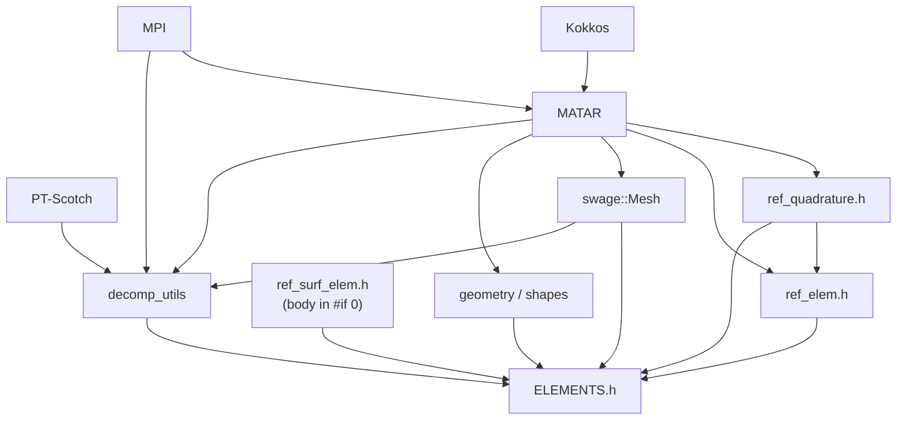
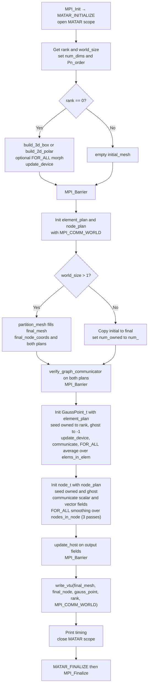

# ELEMENTS Code Context Reference

This document is an AI-agent skill for the [ELEMENTS](https://github.com/lanl/ELEMENTS) C++ library. It provides the public API, mental model, conventions, pitfalls, and end-to-end usage patterns required to write correct code against ELEMENTS, plus a maintainer-oriented section for editing the library itself.

ELEMENTS is built on top of [MATAR](https://github.com/lanl/MATAR). **This document assumes the MATAR skill is loaded separately** and only cross-references MATAR types/macros where an ELEMENTS-specific pattern requires it. Do not duplicate MATAR content here; consult the MATAR skill for `MATAR_INITIALIZE`, `FOR_ALL`, `CArrayDual`, `MPICArrayKokkos`, `CommunicationPlan`, fence rules, host/device sync, etc.

---

## Table of Contents

1. [Purpose and Prerequisites](#1-purpose-and-prerequisites)
2. [Setup and Boilerplate](#2-setup-and-boilerplate)
3. [Data Type Taxonomy](#3-data-type-taxonomy)
4. [Mesh Lifecycle (`swage::Mesh`)](#4-mesh-lifecycle-swagemesh)
5. [Reference Elements and Quadrature](#5-reference-elements-and-quadrature)
6. [Geometry Helpers (`shapes.h`)](#6-geometry-helpers-shapesh)
7. [Mesh Decomposition Workflow](#7-mesh-decomposition-workflow)
8. [State and Halo Communication](#8-state-and-halo-communication)
9. [Mesh I/O Patterns](#9-mesh-io-patterns)
10. [End-to-End Walkthrough: `mesh_decomp_example.cpp`](#10-end-to-end-walkthrough-mesh_decomp_examplecpp)
11. [Common Pitfalls](#11-common-pitfalls)
12. [Maintainer / Internals](#12-maintainer--internals)
13. [Build and Configuration](#13-build-and-configuration)
14. [Ground Truth Constraints for LLMs](#14-ground-truth-constraints-for-llms)
15. [LLM Output Contract](#15-llm-output-contract)

---

## 1. Purpose and Prerequisites

ELEMENTS is a collection of small, header-only C++ sub-libraries for implementing low- and high-order numerical methods (continuous/discontinuous FEM, finite-volume) on 2D/3D unstructured meshes. The library is data-oriented: there are very few classes, mostly plain-old-data structs holding MATAR arrays and free functions that operate on them.

### Sub-libraries

| Sub-library | Header | Role |
|-------------|--------|------|
| **elements** | [src/elements/ref_elem.h](src/elements/ref_elem.h), [ref_quadrature.h](src/elements/ref_quadrature.h), [ref_surf_elem.h](src/elements/ref_surf_elem.h) | Reference element math: tensor-product Lagrange basis on Gauss-Lobatto / Gauss-Legendre points |
| **swage** | [src/swage/unstructured_mesh.h](src/swage/unstructured_mesh.h) | `swage::Mesh` — unstructured 2D/3D mesh of arbitrary order with full connectivity |
| **geometry** | [src/geometry/geometry.h](src/geometry/geometry.h), [shapes.h](src/geometry/shapes.h) | Analytic primitives (`Plane`, `Circle`, `Sphere`) — **not** finite-element shape functions |
| **decomp_utilities** | [src/decomp_utilities/decomp_utils.h](src/decomp_utilities/decomp_utils.h) | PT-Scotch mesh partitioning + ghost layers + MATAR `CommunicationPlan` setup |

The single umbrella header [src/ELEMENTS.h](src/ELEMENTS.h) pulls everything in.

### Sub-library dependency graph



### Required prerequisite skills / knowledge

- **MATAR skill**: types like `CArrayKokkos`, `DCArrayKokkos`, `MPICArrayKokkos`, `RaggedRightArrayKokkos`, `CommunicationPlan`; macros `FOR_ALL`, `FOR_ALL_CLASS`, `FOR_REDUCE_*`, `MATAR_INITIALIZE`, `MATAR_FINALIZE`, `MATAR_FENCE`; the host/device dual-pattern and fence-placement rules.
- **MPI**: rank/size, `MPI_COMM_WORLD`, neighbor collectives. ELEMENTS' decomposition is hardcoded to `MPI_COMM_WORLD`.
- **PT-Scotch (optional)**: only if reading/modifying `decomp_utils.h` internals; consumers do not need to call Scotch directly.

### Namespaces used

| Namespace | Contents |
|-----------|----------|
| `mtr::` | All MATAR types and macros (brought in via `using namespace mtr;`) |
| `swage::` | `Mesh` (the central mesh struct) and the small index functor structs |
| `elements::` | `partition_mesh`, `naive_partition_mesh`, `build_ghost`; the free quadrature helpers in `ref_quadrature.h` |
| `geometry::` | `Plane`, `Circle`, `Sphere` |
| `mesh_init::` | `elem_name_tag` enum |
| `mesh_input::` | `source` and `type` enums (used by example `mesh_input_t`) |

---

## 2. Setup and Boilerplate

### Single header for consumers

```cpp
#include "ELEMENTS.h"
```

This header includes MATAR plus every ELEMENTS sub-library header. See [src/ELEMENTS.h](src/ELEMENTS.h):

```1:20:src/ELEMENTS.h
#ifndef ELEMENTS_LIBRARY_H
#define ELEMENTS_LIBRARY_H

// --- Core Dependencies ---
#include "matar.h"

// --- Swage Headers (Mesh & Core) ---
#include "swage/unstructured_mesh.h"
#include "elements/ref_elem.h"
#include "elements/ref_surf_elem.h"
#include "elements/ref_quadrature.h"


// --- Decomp Utilities ---
#include "decomp_utilities/decomp_utils.h"

// --- Geometry Headers ---
#include "geometry/geometry.h"

#endif // ELEMENTS_LIBRARY_H
```

### Initialization order is critical

For MPI programs, **`MPI_Init` must come before `MATAR_INITIALIZE`** and **`MPI_Finalize` must come after `MATAR_FINALIZE`**. The MATAR scope braces must enclose every MATAR-owned object so destructors run before `MATAR_FINALIZE`.

#### Template A — serial / single-rank ELEMENTS program

```cpp
// COMPILES_AS_IS (assuming you fill in the body)
#include "ELEMENTS.h"

using namespace mtr;

int main(int argc, char** argv) {
    MATAR_INITIALIZE(argc, argv);
    { // MATAR scope
        // Build a swage::Mesh, call build_connectivity, do work.
        // All MATAR/ELEMENTS objects must live INSIDE this scope.
    }
    MATAR_FINALIZE();
    return 0;
}
```

#### Template B — MPI / multi-rank ELEMENTS program

```cpp
// COMPILES_AS_IS (assuming you fill in the body)
#include <mpi.h>
#include "ELEMENTS.h"
#include "state.h"     // node_t, GaussPoint_t, State_t  (from examples/*/include)
#include "mesh_io.h"   // build_3d_box, write_vtu        (from examples/*/include)

using namespace mtr;

int main(int argc, char** argv) {
    MPI_Init(&argc, &argv);
    MATAR_INITIALIZE(argc, argv);
    { // MATAR scope
        int rank, size;
        MPI_Comm_rank(MPI_COMM_WORLD, &rank);
        MPI_Comm_size(MPI_COMM_WORLD, &size);

        swage::Mesh initial_mesh;
        MPICArrayKokkos<double> initial_node_coords;
        // ... build on rank 0, partition, communicate ...
    }
    MATAR_FINALIZE();
    MPI_Finalize();
    return 0;
}
```

The decomp example shows the canonical ordering:

```32:36:examples/decomp_example/src/mesh_decomp_example.cpp
int main(int argc, char** argv) {

    MPI_Init(&argc, &argv);
    MATAR_INITIALIZE(argc, argv);
    { // MATAR scope
```

```294:297:examples/decomp_example/src/mesh_decomp_example.cpp
    } // end MATAR scope
    MATAR_FINALIZE();
    MPI_Finalize();

    return 0;
```

### `state.h` and `mesh_io.h` are example infrastructure, not library headers

The structs `node_t`, `GaussPoint_t`, `State_t`, the input-deck `mesh_input_t`, and the I/O functions (`build_3d_box`, `build_2d_polar`, `write_vtu`, `write_vtk`, `read_vtk_mesh`) live in [examples/decomp_example/include/](examples/decomp_example/include/) and [examples/average/include/](examples/average/include/). They are not part of the installed library. Treat them as **reference implementations** that downstream applications copy and adapt, and cite the example file path when generating code that depends on them.

---

## 3. Data Type Taxonomy

ELEMENTS exposes a small set of user-facing types. Use this table to pick the right one.

### Mesh and state

| Type | Defined in | Role |
|------|------------|------|
| `swage::Mesh` | [src/swage/unstructured_mesh.h](src/swage/unstructured_mesh.h) | The mesh: counts, connectivity, MPI ownership metadata. Two mutually exclusive init paths (linear vs arbitrary-order tensor). |
| `node_t` | [examples/*/include/state.h](examples/decomp_example/include/state.h) | Per-node state wrapper holding `MPICArrayKokkos<double>` for `coords`, `coords_n0`, `scalar_field`, `vector_field`. |
| `GaussPoint_t` | [examples/*/include/state.h](examples/decomp_example/include/state.h) | Per-cell/Gauss-point state: `MPICArrayKokkos<double>` for `fields` and `fields_vec`. |
| `State_t` | [examples/*/include/state.h](examples/decomp_example/include/state.h) | Bundle: `node_t node;` + `GaussPoint_t GaussPoints;`. |
| `mesh_input_t` | [examples/*/include/mesh_inputs.h](examples/decomp_example/include/mesh_inputs.h) | Input-deck struct: `num_dims`, `source`, `file_path`, `type`, `origin[3]`, `length[3]`, `num_elems[3]`, `p_order`, polar params, scale, `object_ids`. |

### Reference element / quadrature

| Type / function | Defined in | Role |
|-----------------|------------|------|
| `fe_ref_elem_t` | [src/elements/ref_elem.h](src/elements/ref_elem.h) | Reference **volume** element (3D-only `init` body today). Tensor-product Lagrange basis on Gauss-Lobatto + Gauss-Legendre grids; pre-tabulates basis values and gradients. |
| `fe_ref_surf_t` | [src/elements/ref_surf_elem.h](src/elements/ref_surf_elem.h) | **Currently a placeholder.** The struct compiles to an empty type because lines 19-2118 are wrapped in `#if 0`. Do not call any methods on it. |
| `elements::get_lobatto_nodes_1D`, `get_lobatto_weights_1D`, `get_legendre_nodes_1D`, `get_legendre_weights_1D` | [src/elements/ref_quadrature.h](src/elements/ref_quadrature.h) | Free `static KOKKOS_FUNCTION` helpers that fill a pre-allocated `CArrayKokkos<double>` with 1D quadrature data. Stateless. |

### Analytic geometry

| Type | Defined in | Role |
|------|------------|------|
| `geometry::Plane` | [src/geometry/shapes.h](src/geometry/shapes.h) | Infinite plane; method `is_point_on_plane(point)`. |
| `geometry::Circle` | [src/geometry/shapes.h](src/geometry/shapes.h) | Circle in space; method `is_point_on_circle(point)`. |
| `geometry::Sphere` | [src/geometry/shapes.h](src/geometry/shapes.h) | 3D sphere; methods `is_point_on_sphere`, `is_point_inside_sphere`, `signed_distance_to_sphere`. |

These are **analytic predicates**, not finite-element shape functions. There is no `Hex8`, `Tet4`, `Quad4`, etc. in this library.

### Decomposition entry points

| Function | Defined in | Role |
|----------|------------|------|
| `elements::naive_partition_mesh(...)` | [src/decomp_utilities/decomp_utils.h](src/decomp_utilities/decomp_utils.h) | Round-robin scatter from rank 0 to all ranks (no Scotch). |
| `elements::partition_mesh(...)` | [src/decomp_utilities/decomp_utils.h](src/decomp_utilities/decomp_utils.h) | High-level driver: naive partition → PT-Scotch → redistribute → ghost layer. The function consumers normally call. |
| `elements::build_ghost(...)` | [src/decomp_utilities/decomp_utils.h](src/decomp_utilities/decomp_utils.h) | Identifies shared/ghost entities and fills two `CommunicationPlan`s (element + node). |

### MATAR types you will see most

The MATAR types most frequently used in ELEMENTS code (full reference in the MATAR skill):

| Type | Used for |
|------|---------|
| `DCArrayKokkos<size_t>` | Connectivity tables (`nodes_in_elem`, `local_to_global_*_mapping`, boundary IDs). Dual host/device. |
| `CArrayKokkos<size_t>` / `CArrayKokkos<double>` | Stride arrays, surface/patch lists, basis tables, quadrature points. Device. |
| `RaggedRightArrayKokkos<size_t>` | Variable-length adjacency: `elems_in_elem`, `corners_in_node`, `nodes_in_node`, `bdy_patches_in_set`. |
| `MPICArrayKokkos<double>` | Halo-aware fields: node coordinates, `node_t` / `GaussPoint_t` members. Wraps a `DCArrayKokkos` and a `CommunicationPlan`. |
| `CArrayDual<int>` | Small two-sided arrays used during partitioning (`elems_in_elem_on_rank`). |
| `CommunicationPlan` | MPI neighbor topology; one for elements, one for nodes. |
| `ViewCArrayKokkos<double>` | Used by `geometry::Plane/Circle/Sphere` to wrap caller-owned coordinate buffers. |

---

## 4. Mesh Lifecycle (`swage::Mesh`)

### The struct is `swage::Mesh` (not `mesh_t`)

The closing comment in the header reads `}; // end Mesh_t` but the actual type is `swage::Mesh`. Always type `swage::Mesh`.

```217:226:src/swage/unstructured_mesh.h
struct Mesh
{
    // ******* Entity Definitions **********//
    // Element: A hexahedral volume
    // Zone: A discretization of an element base on subdividing the element using the nodes
    // Node: A kinematic degree of freedom
    // Surface: The 2D surface of the element
    // Patch: A discretization of a surface by subdividing the surface using the nodes
    // Corner: A element-node pair
```

### Entity vocabulary

| Entity | Meaning | Notes |
|--------|---------|-------|
| **Element** | Volume cell (hex in 3D, quad in 2D) | Index variable: `elem_gid`. The primary volumetric unit. |
| **Node** | Kinematic DOF | Index: `node_gid`. For high-order meshes there are many nodes per element, not just 8 vertices. `num_nodes_in_elem = (Pn+1)^num_dims` for arbitrary-order; `2^num_dims` for linear. |
| **Zone** | Subcell partition of an element | `num_zones_in_elem = Pn^num_dims`. Each zone has `2^num_dims` nodes. Used in DG-style schemes. |
| **Surface** | 2D interface (or 1D edge in 2D) of the element | `num_surfs_in_elem` is 4 (2D) or 6 (3D). |
| **Patch** | Subdivision of a surface | `num_nodes_in_patch = 2*(num_dims - 1)` (2 in 2D, 4 in 3D). Interior patches are paired across adjacent elements; boundary patches are collected in `bdy_patches`. |
| **Corner** | (element, local-node) pair | Global corner id = `node_lid + elem_gid * num_nodes_in_elem`. |
| **Gauss point** | Volume quadrature point | `gauss_in_elem(elem_gid, gauss_lid) →` global Gauss id; populated via `gauss_in_elem_t` functor. |
| **Lobatto point** | Material/interface point | `lobatto_in_elem` functor exists; some Lobatto wiring in `build_patch_connectivity` is incomplete (commented out). |

The two element-formulation tags live in `mesh_init`:

```44:55:src/swage/unstructured_mesh.h
namespace mesh_init
{
// element mesh types
enum elem_name_tag
{
    linear_simplex_element = 0,
    linear_tensor_element = 1,
    arbitrary_tensor_element = 2
};

// other enums could go here on the mesh
} // end namespace
```

`linear_simplex_element` is reserved but not actively used by the build routines today — the `build_patch_connectivity` switches between linear-tensor (hex/quad with fixed local-node tables) and arbitrary-tensor (Pn-order, tensor indexing).

### Hex node ordering (linear, 0-7)

For `linear_tensor_element` in 3D, the hex local-node ordering is documented at the top of [src/swage/unstructured_mesh.h](src/swage/unstructured_mesh.h):

```57:94:src/swage/unstructured_mesh.h
/*
==========================
Nodal indexing convention
==========================

              K
              ^         J
              |        /
              |       /
              |      /
      6------------------7
     /|                 /|
    / |                / |
   /  |               /  |
  /   |              /   |
 /    |             /    |
4------------------5     |
|     |            |     | ----> I
|     |            |     |
|     |            |     |
|     |            |     |
|     2------------|-----3
|    /             |    /
|   /              |   /
|  /               |  /
| /                | /
|/                 |/
0------------------1

nodes are ordered for outward normal
patch 0: [0,4,6,2]  xi-minus dir
patch 1: [1,3,7,5]  xi-plus  dir
patch 2: [0,1,5,4]  eta-minus dir
patch 3: [3,2,6,7]  eta-plus  dir
patch 4: [0,2,3,1]  zeta-minus dir
patch 6: [4,5,7,6]  zeta-plus  dir
*/
```

This is **not** standard VTK or Ensight order. The `mesh_io.h` readers/writers in the examples include explicit reordering tables (e.g. an "Ensight to IJK" permutation in `read_vtk_mesh`).

### Mesh build protocol

The lifecycle is a strict ordered protocol. You must:

1. Set the node count.
2. Choose **exactly one** of the two `initialize_elems*` paths and fill `nodes_in_elem` with **global** node IDs.
3. Call `build_connectivity()`.

```mermaid
flowchart TD
    A[initialize_nodes&#40;N&#41;] --> B{High order?}
    B -- "p_order == 1<br/>(linear hex/quad)" --> C[initialize_elems&#40;E, dim&#41;]
    B -- "p_order > 1<br/>(arbitrary tensor)" --> D[initialize_elems_Pn&#40;E, dim, Pn&#41;]
    C --> E[Fill nodes_in_elem&#40;elem_gid, node_lid&#41;<br/>with global node IDs]
    D --> E
    E --> F[build_connectivity&#40;&#41;]
    F --> G[build_corner_connectivity]
    F --> H[build_elem_elem_connectivity]
    F --> I[build_patch_connectivity]
    F --> J[build_node_node_connectivity]
    G --> H
    H --> I
    I --> J
```



`build_connectivity()` runs the four sub-builds in this fixed order:

```1468:1482:src/swage/unstructured_mesh.h
    void build_connectivity()
    {
        verbose = true;
        build_corner_connectivity();
        if (verbose) printf("Built corner connectivity \n");

        build_elem_elem_connectivity();
        if (verbose) printf("Built element-element connectivity \n");

        build_patch_connectivity();
        if (verbose) printf("Built patch connectivity \n");

        build_node_node_connectivity();
        if (verbose) printf("Built node-node connectivity \n");
    }
```

Always prefer `build_connectivity()` over calling the four `build_*` functions individually unless you have a specific reason. The functions have ordering dependencies (`elem_elem` requires `corner`; `patch` requires `elem_elem`; `node_node` requires `patch`).

**`build_connectivity()` sets `verbose = true` as a side effect.** If you do not want the printf output, set `mesh.verbose = false` after calling it.

### Linear vs arbitrary-order init

```340:361:src/swage/unstructured_mesh.h
    void initialize_elems(const size_t num_elems_inp, const size_t num_dims_inp)
    {
        num_dims = num_dims_inp;
        num_nodes_in_elem = 1;
        
        for (int dim = 0; dim < num_dims; dim++) {
            num_nodes_in_elem *= 2;
        }
        num_elems       = num_elems_inp;
        nodes_in_elem   = DCArrayKokkos<size_t>(num_elems, num_nodes_in_elem, "mesh.nodes_in_elem");
        corners_in_elem = CArrayKokkos<size_t>(num_elems, num_nodes_in_elem, "mesh.corners_in_elem");

        // 1 Gauss point per element
        num_gauss_in_elem = 1;

        // 1 zone per element
        num_zones_in_elem = 1;

        gauss_in_elem = gauss_in_elem_t(num_gauss_in_elem);

        return;
    }; // end method
```

```364:394:src/swage/unstructured_mesh.h
    void initialize_elems_Pn(
        const size_t num_elems_inp,
        const size_t num_dims_inp, 
        const size_t Pn_order)
    {


        elem_kind = mesh_init::arbitrary_tensor_element;
        
        num_dims  = num_dims_inp;
        num_elems = num_elems_inp;  

        Pn = Pn_order;

        num_nodes_in_elem     = std::pow(Pn_order + 1, num_dims); //(Pn_order + 1)**num_dims; // (Pn +1)
        num_nodes_in_zone     = std::pow(2, num_dims); // (4, or 8, always)
        num_gauss_in_elem     = std::pow(2*Pn_order, num_dims); // = 2*Pn
        num_zones_in_elem     = std::pow(Pn_order, num_dims);  // Pn
        num_surfs_in_elem     = num_dims == 2 ? 4 : 6; // 4 or 6 (always)

        num_zones = num_zones_in_elem * num_elems;

        nodes_in_elem    = DCArrayKokkos<size_t>(num_elems, num_nodes_in_elem, "mesh.nodes_in_elem");
        corners_in_elem  = CArrayKokkos<size_t>(num_elems, num_nodes_in_elem, "mesh.corners_in_elem");
        zones_in_elem    = zones_in_elem_t(num_zones_in_elem);
        surfs_in_elem    = CArrayKokkos<size_t>(num_elems, num_surfs_in_elem, "mesh.surfs_in_zone");
        nodes_in_zone    = CArrayKokkos<size_t>(num_zones, num_nodes_in_zone, "mesh.nodes_in_zone");
        gauss_in_elem = gauss_in_elem_t(num_gauss_in_elem);

        return;
    }; // end method
```

Choose based on `Pn_order`: `1` → `initialize_elems`; `>= 2` → `initialize_elems_Pn`. Mixing the two on the same `Mesh` is undefined — `initialize_elems` does not set `elem_kind = arbitrary_tensor_element` and does not allocate `surfs_in_elem` / `nodes_in_zone`.

### Filling `nodes_in_elem`

After init, write into `nodes_in_elem` on the host using `.host(elem_gid, node_lid) = node_gid` (it is a `DCArrayKokkos<size_t>`). Then push to device with `nodes_in_elem.update_device()` if you need device access. The example builders (`build_3d_box`, `build_2d_polar`) handle this for you — see the `mesh_io.h` reference in [examples/decomp_example/include/mesh_io.h](examples/decomp_example/include/mesh_io.h).

### Connectivity arrays (read-only after build)

| Name | Type | Shape / meaning |
|------|------|-----------------|
| `nodes_in_elem` | `DCArrayKokkos<size_t>` | `(num_elems, num_nodes_in_elem)` — global node IDs |
| `corners_in_elem` | `CArrayKokkos<size_t>` | `(num_elems, num_nodes_in_elem)` — corner IDs |
| `corners_in_node` | `RaggedRightArrayKokkos<size_t>` | per node, list of corner GIDs |
| `num_corners_in_node` | `CArrayKokkos<size_t>` | `(num_nodes,)` |
| `elems_in_node` | `RaggedRightArrayKokkos<size_t>` | per node, elements touching it |
| `elems_in_elem` | `RaggedRightArrayKokkos<size_t>` | per element, neighboring element GIDs |
| `num_elems_in_elem` | `CArrayKokkos<size_t>` | per-element neighbor counts |
| `nodes_in_node` | `RaggedRightArrayKokkos<size_t>` | per node, neighbor nodes along edges |
| `num_nodes_in_node` | `CArrayKokkos<size_t>` | per-node neighbor counts |
| `patches_in_elem`, `surfs_in_elem` | `CArrayKokkos<size_t>` | element-side patch/surface tables |
| `nodes_in_patch`, `elems_in_patch`, `surf_in_patch` | `CArrayKokkos<size_t>` | patch-side connectivity |
| `nodes_in_surf`, `elems_in_surf`, `patches_in_surf` | `CArrayKokkos<size_t>` | surface-side connectivity |
| `nodes_in_zone` | `CArrayKokkos<size_t>` | `(num_zones, num_nodes_in_zone)` — only valid after `initialize_elems_Pn` |
| `bdy_patches`, `bdy_nodes` | `CArrayKokkos<size_t>` | flat boundary lists |
| `bdy_patches_in_set`, `bdy_nodes_in_set` | `RaggedRightArrayKokkos<size_t>` | per boundary set; **populated by application code in `tag_bdys` (see comment in `init_bdy_sets`), not by `build_connectivity`** |

### Index functors

`zones_in_elem`, `gauss_in_elem`, `lobatto_in_elem` are not arrays — they are tiny stride-flattening structs:

```115:139:src/swage/unstructured_mesh.h
struct zones_in_elem_t
{
    private:
        size_t num_zones_in_elem_;
    public:
        zones_in_elem_t() {
        };

        zones_in_elem_t(const size_t num_zones_in_elem_inp) {
            this->num_zones_in_elem_ = num_zones_in_elem_inp;
        };

        // return global zone index for given local zone index in an element
        size_t host(const size_t elem_gid, const size_t zone_lid) const
        {
            return elem_gid * num_zones_in_elem_ + zone_lid;
        };

        // Return the global zone ID given an element gloabl ID and a local zone ID
        KOKKOS_INLINE_FUNCTION
        size_t operator()(const size_t elem_gid, const size_t zone_lid) const
        {
            return elem_gid * num_zones_in_elem_ + zone_lid;
        };
};
```

Use them as `mesh.zones_in_elem(elem_gid, zone_lid)` inside device kernels and `mesh.zones_in_elem.host(elem_gid, zone_lid)` on the host. `gauss_in_elem_t` and `lobatto_in_elem_t` follow the same pattern.

### Boundary sets

```cpp
// COMPILES_AS_IS (after building mesh)
mesh.init_bdy_sets(num_bcs);
// At this point only num_bdy_sets and num_bdy_patches_in_set are allocated.
// Filling bdy_patches_in_set and bdy_nodes_in_set is the application's job
// (see geometry_new.cpp pattern in the legacy code).
```

The header explicitly defers ragged boundary set construction to a `tag_bdys`-style function written outside `swage::Mesh`. Do not assume `build_connectivity` populates these.

### MPI ownership fields (filled by `decomp_utils`)

After a successful call to `elements::partition_mesh`, the `final_mesh` will have:

| Field | Meaning |
|-------|---------|
| `local_to_global_node_mapping` | `DCArrayKokkos<size_t>`, length `num_nodes` |
| `local_to_global_elem_mapping` | `DCArrayKokkos<size_t>`, length `num_elems` |
| `num_owned_elems` / `num_owned_nodes` | Count of owned (non-ghost) entities; ranks `[0, num_owned_*)` are owned, `[num_owned_*, num_*)` are ghost |
| `num_boundary_elems` / `num_boundary_nodes` | Count of locally-owned entities that are sent to neighbors |
| `boundary_elem_local_ids` / `boundary_node_local_ids` | `DCArrayKokkos<size_t>` of local IDs for entities that send data |
| `num_ghost_elems` / `num_ghost_nodes` | Count of received entities |

For a single-rank fallback (`world_size == 1`), set these manually:

```129:133:examples/decomp_example/src/mesh_decomp_example.cpp
        final_mesh = initial_mesh;
        final_mesh.num_owned_elems = initial_mesh.num_elems;
        final_mesh.num_owned_nodes = initial_mesh.num_nodes;
        final_node_coords = initial_node_coords;
```

---

## 5. Reference Elements and Quadrature

### `fe_ref_elem_t` (volume)

Defined in [src/elements/ref_elem.h](src/elements/ref_elem.h) as a plain struct of `size_t` counts plus `CArrayKokkos<double>` / `CArrayKokkos<size_t>` tables. Construct with default constructor, then call `init(p_order, num_dim_inp)` exactly once:

```cpp
// PSEUDOCODE_PATTERN
fe_ref_elem_t ref_elem;
ref_elem.init(p_order, 3);  // 3D today
```

**Important caveat:** the body of `init` that fills the 3D tensor-product point/weight/basis tables is guarded by `if (num_dim == 3)`. Calling `init(p_order, 2)` will set the 1D counts and allocate arrays but will leave the 3D tables un-populated. **Treat `fe_ref_elem_t` as 3D-only for now.**

#### Counts (after `init`)

| Field | Meaning (for `p > 0`) |
|-------|-----------------------|
| `num_dofs_1d` | `p_order + 1` (CG kinematic DOFs in 1D) |
| `num_dg_dofs_1d` | `p_order` (DG / "thermo" DOFs in 1D) |
| `num_lobotto_1d` | `2*p_order + 1` (Gauss-Lobatto points in 1D) |
| `num_dual_lobotto_1d` | `2*p_order - 1` |
| `num_gauss_1d` | `2*p_order` (Gauss-Legendre in 1D) |
| `num_zones_1d` | `p_order` |
| `num_dofs_in_elem`, `num_lobotto_in_elem`, `num_gauss_in_elem`, `num_zones_in_elem`, ... | Each = corresponding 1D count to the power `num_dim`. |

For `p_order == 0` the special case is `num_lobotto_1d = 2`, `num_dofs_1d = 2`, `num_zones_1d = 1`, `num_gauss_1d = 1`.

#### Pre-tabulated arrays (read after `init`)

| Field | Shape | Contents |
|-------|-------|----------|
| `lob_points_1D`, `dual_lob_points_1D`, `leg_nodes_1D` | `(num_*_1d,)` | 1D abscissas |
| `lob_weights_1D`, `leg_weights_1D` | `(num_*_1d,)` | 1D weights |
| `lobotto_point_positions`, `gauss_point_positions` | `(num_*_in_elem, num_dim)` | 3D quadrature points |
| `lobotto_point_weights`, `gauss_point_weights` | `(num_*_in_elem,)` | 3D quadrature weights |
| `dof_positions`, `dof_positions_1d` | DOF coordinates (CG basis) |
| `dg_dof_positions`, `dg_dof_positions_1d` | DOF coordinates (DG basis) |
| `lobotto_point_basis`, `gauss_point_basis` | `(num_*_in_elem, num_basis)` | CG basis values at quadrature points |
| `lobotto_point_dg_basis`, `gauss_point_dg_basis` | `(num_*_in_elem, num_dg_basis)` | DG basis values |
| `lobotto_point_grad_basis`, `gauss_point_grad_basis` | gradients in reference coords |
| `dof_lobatto_map`, `dual_dof_lobatto_map` | `CArrayKokkos<size_t>` | Maps from DOF to Lobatto-grid index |

#### Index helpers (KOKKOS_INLINE_FUNCTION)

Defined inside `fe_ref_elem_t`:

| Method | Returns |
|--------|---------|
| `dof_rid(i, j, k)` | Flat CG DOF index from i,j,k tensor coordinates |
| `elem_dof_rid(i, j, k)` | Flat DG DOF index |
| `lobatto_rid(i, j, k)` | Flat Lobatto quadrature point index |
| `dual_lobatto_rid(i, j, k)` | Flat dual Lobatto index |
| `legendre_rid(i, j, k)` | Flat Gauss-Legendre point index |
| `legendre_rid_2D(i, j)` | 2D legendre index helper |

#### On-the-fly basis evaluation

For evaluating the basis (or its gradient) at an arbitrary reference point, call:

| Method | Purpose |
|--------|---------|
| `get_basis(basis, val_1d, val_3d, point)` | CG basis at `point` |
| `get_elem_basis(basis, val_1d, val_3d, point)` | DG basis at `point` |
| `partial_xi_basis(partial_xi, val_1d, val_3d, Dval_1d, Dval_3d, point)` | ∂/∂ξ of CG basis |
| `partial_eta_basis(...)` | ∂/∂η |
| `partial_mu_basis(...)` | ∂/∂μ (the third reference coord) |
| `lagrange_basis_1D(interp, x_point)` | 1D Lagrange interpolant at `x_point` (CG nodes) |
| `lagrange_elem_basis_1D(interp, x_point)` | 1D Lagrange interpolant at `x_point` (DG nodes) |
| `lagrange_derivative_1D(derivative, x_point)` | 1D Lagrange derivative |

The caller supplies workspace buffers as `CArrayKokkos<double>`:
- `val_1d` length `num_dofs_1d`
- `val_3d` shape `(num_dofs_1d, 3)`
- `Dval_1d`, `Dval_3d` for derivatives, same shapes
- `point` length 3
- `basis` length `num_basis`

### `fe_ref_surf_t` is currently inactive

```cpp
// File: src/elements/ref_surf_elem.h
// Lines 17-18: struct opens
// Line 19:    #if 0     // ENTIRE BODY DISABLED
// ...
// Line 2118: #endif
// Line 2120: };         // empty struct closes
```

The compiled type `fe_ref_surf_t` has **no data members and no methods**. It still compiles into [src/ELEMENTS.h](src/ELEMENTS.h), but instantiating it gives you an empty struct. **Do not generate code that calls any method on `fe_ref_surf_t`.** If a 2D surface basis is required, either (a) use the 1D / 2D parts of `fe_ref_elem_t` directly, or (b) flag this as a known gap to the user.

### `ref_quadrature.h` — free helpers

The header is a `namespace elements { ... }` of stateless `static KOKKOS_FUNCTION` writers that fill a pre-allocated 1D buffer:

```cpp
// PSEUDOCODE_PATTERN
using namespace mtr;
CArrayKokkos<double> nodes(N, "nodes_1D");
CArrayKokkos<double> weights(N, "weights_1D");

elements::get_lobatto_nodes_1D(nodes, N);
elements::get_lobatto_weights_1D(weights, N);

elements::get_legendre_nodes_1D(nodes, N);
elements::get_legendre_weights_1D(weights, N);
```

These are large hard-coded if-cascades on `N`. Supported `N` values are bounded by what is tabulated in the source — check [src/elements/ref_quadrature.h](src/elements/ref_quadrature.h) for the exact list before generating code with an unusual order.

---

## 6. Geometry Helpers (`shapes.h`)

`geometry::Plane`, `geometry::Circle`, `geometry::Sphere` are analytic primitives, not FE shapes. Each constructor takes `ViewCArrayKokkos<double>` views of caller-owned position (and normal/radius) buffers. All predicate methods are `KOKKOS_INLINE_FUNCTION` and assume 1D views with extents matching `num_dims`.

### Constructors

```cpp
// COMPILES_AS_IS (assuming MATAR scope)
using namespace mtr;

double pos_data[3]    = {0.0, 0.0, 0.0};
double normal_data[3] = {0.0, 0.0, 1.0};
ViewCArrayKokkos<double> pos(pos_data, 3);
ViewCArrayKokkos<double> normal(normal_data, 3);

geometry::Plane  plane(pos, normal);
geometry::Circle circle(pos, normal, /*radius=*/1.0);
geometry::Sphere sphere(pos, /*radius=*/1.0);
```

The `Plane` and `Circle` constructors normalize the supplied normal in place; if the input normal has zero length, `Plane` throws `std::runtime_error` while `Circle` falls back to `(1, 0, 0)`. `Sphere` requires `position.extent() == 3`.

### Predicates

| Method | Type | Notes |
|--------|------|-------|
| `Plane::is_point_on_plane(point)` | `bool` | `|n . (p - x0)| < epsilon` |
| `Circle::is_point_on_circle(point)` | `bool` | On plane AND distance < radius |
| `Sphere::is_point_on_sphere(point)` | `bool` | `|distance - radius| < epsilon` |
| `Sphere::is_point_inside_sphere(point)` | `bool` | `distance < radius` |
| `Sphere::signed_distance_to_sphere(point)` | `double` | `distance - radius` |

`epsilon` defaults to `1e-7` per object and is a public field if you need to override it before calling.

### What does NOT exist

There is no `Hex8`, `Tet4`, `Quad4`, `evaluate_basis(xi, eta)`, `jacobian()`, or `node_coords()` API in `geometry/`. Do not invent them. For FE basis evaluation use `fe_ref_elem_t` (Section 5).

---

## 7. Mesh Decomposition Workflow

`decomp_utils.h` provides three free functions in `namespace elements`. The one consumers normally call is `partition_mesh`; the other two are exposed building blocks.

### Three entry points

| Function | When to call |
|----------|-------------|
| `naive_partition_mesh` | Block-distribute global mesh (rank 0) into contiguous element ranges across all ranks. Minimal communication setup. Exposed mostly for `partition_mesh`'s internal use. |
| `partition_mesh` | The high-level driver. Handles naive partition → PT-Scotch repartition → halo construction → fills both `CommunicationPlan`s. **This is the one to call.** |
| `build_ghost` | Given an already-partitioned mesh, identify shared-boundary and ghost entities and populate two `CommunicationPlan`s. Called by `partition_mesh`. |

### `partition_mesh` signature

```1712:1720:src/decomp_utilities/decomp_utils.h
inline void partition_mesh(
    swage::Mesh& initial_mesh,
    swage::Mesh& final_mesh,
    MPICArrayKokkos<double>& initial_node_coords,
    MPICArrayKokkos<double>& final_node_coords,
    CommunicationPlan& element_communication_plan,
    CommunicationPlan& node_communication_plan,
    int world_size,
    int rank){
```

- `initial_mesh` / `initial_node_coords`: must be valid on rank 0; can be empty/default on other ranks.
- `final_mesh` / `final_node_coords`: outputs. Will be sized for owned + ghost entities on each rank.
- `element_communication_plan`, `node_communication_plan`: must be **already initialized** with `MPI_COMM_WORLD` (see workflow below). The function fills the rest.
- `world_size`, `rank`: from `MPI_Comm_size` / `MPI_Comm_rank`. The function uses **`MPI_COMM_WORLD` exclusively** internally; `world_size` and `rank` are passed for convenience, not for routing on a non-default communicator.

### Canonical workflow

```mermaid
flowchart TD
    A[MPI_Init then MATAR_INITIALIZE] --> B[Build initial_mesh on rank 0<br/>Build initial_node_coords on rank 0]
    B --> C[MPI_Barrier]
    C --> D[Construct two CommunicationPlans<br/>and call .initialize&#40;MPI_COMM_WORLD&#41;]
    D --> E{world_size > 1?}
    E -- "Yes" --> F[elements::partition_mesh&#40;...&#41;]
    E -- "No" --> G[final_mesh = initial_mesh<br/>num_owned_elems = num_elems<br/>num_owned_nodes = num_nodes<br/>final_node_coords = initial_node_coords]
    F --> H[verify_graph_communicator on both plans]
    G --> H
    H --> I[Initialize node_t / GaussPoint_t<br/>with the appropriate plan]
    I --> J[Compute, communicate, write VTU]
```



### Code template

```cpp
// PSEUDOCODE_PATTERN — fills in mesh build, communication, and output
#include <mpi.h>
#include "ELEMENTS.h"
#include "state.h"
#include "mesh_io.h"

using namespace mtr;

int main(int argc, char** argv) {
    MPI_Init(&argc, &argv);
    MATAR_INITIALIZE(argc, argv);
    {
        int rank, world_size;
        MPI_Comm_rank(MPI_COMM_WORLD, &rank);
        MPI_Comm_size(MPI_COMM_WORLD, &world_size);

        swage::Mesh initial_mesh;
        MPICArrayKokkos<double> initial_node_coords;

        if (rank == 0) {
            double origin[3] = {0.0, 0.0, 0.0};
            double length[3] = {1.0, 1.0, 1.0};
            int    nelems[3] = {20, 20, 20};
            int    Pn_order  = 3;
            build_3d_box(initial_mesh, initial_node_coords, origin, length, nelems, Pn_order);
        }
        MPI_Barrier(MPI_COMM_WORLD);

        CommunicationPlan element_plan;
        element_plan.initialize(MPI_COMM_WORLD);
        CommunicationPlan node_plan;
        node_plan.initialize(MPI_COMM_WORLD);

        swage::Mesh final_mesh;
        MPICArrayKokkos<double> final_node_coords;

        if (world_size != 1) {
            elements::partition_mesh(initial_mesh, final_mesh,
                                     initial_node_coords, final_node_coords,
                                     element_plan, node_plan,
                                     world_size, rank);
        } else {
            final_mesh = initial_mesh;
            final_mesh.num_owned_elems = initial_mesh.num_elems;
            final_mesh.num_owned_nodes = initial_mesh.num_nodes;
            final_node_coords = initial_node_coords;
        }

        // Now use final_mesh + element_plan / node_plan to allocate state and run.
    }
    MATAR_FINALIZE();
    MPI_Finalize();
    return 0;
}
```

### What happens inside `partition_mesh`

1. **`naive_partition_mesh`** scatters elements/connectivity/coordinates from rank 0 in contiguous blocks; produces a `naive_mesh` and CSR neighbor lists per local element.
2. **PT-Scotch** is initialized with `SCOTCH_dgraphInit(&dgraph, MPI_COMM_WORLD)`. The graph is built from the per-rank element CSR (`vertloctab` / `edgeloctab` containing global element IDs of neighbors). Strategy is `SCOTCH_STRATQUALITY` with imbalance ratio `0.001`, mapping to a `SCOTCH_archCmplt(arch, world_size)` complete-graph architecture.
3. **`SCOTCH_dgraphMap`** assigns each local element a destination rank in `partloctab`.
4. Elements, connectivity, and node coordinates are **redistributed** with `MPI_Alltoall` + `MPI_Alltoallv` into an `intermediate_mesh`. Then `intermediate_mesh.build_connectivity()` is called.
5. **`build_ghost`** identifies which owned elements/nodes are shared with which neighbor ranks, builds the ghost layer in `final_mesh`, and fills both `CommunicationPlan`s via `initialize_graph_communicator` + `setup_send_recv` (using `DRaggedRightArrayKokkos<int>` send/recv index lists).

After `partition_mesh` returns:
- `final_mesh.num_elems` = owned + ghost elements; `final_mesh.num_owned_elems` = owned only.
- Same for `num_nodes` / `num_owned_nodes`.
- Element local IDs `[0, num_owned_elems)` are owned, `[num_owned_elems, num_elems)` are ghost. Same for nodes.
- `local_to_global_*_mapping` is filled.
- Both `CommunicationPlan`s are ready to be attached to `MPICArrayKokkos` fields via `field.initialize_comm_plan(plan)`.

### PT-Scotch hard-codings to be aware of

- The communicator is **always** `MPI_COMM_WORLD`. Calling `partition_mesh` from inside a sub-communicator requires editing the source.
- The graph is **element-adjacency only** — no node-based partitioning, no weights.
- Architecture is always a complete graph of size `world_size` (one part per rank); cannot map to a hierarchical machine topology without modifying the function.

---

## 8. State and Halo Communication

State containers (`node_t`, `GaussPoint_t`) hold `MPICArrayKokkos<double>` fields. Each field carries its own packed send/recv buffers and a pointer to a shared `CommunicationPlan`. Halo exchange is `field.communicate()`.

### Initialization

```59:101:examples/decomp_example/include/state.h
struct node_t
{

    // Replace with MPIDCArrayKokkos
    MPICArrayKokkos<double> coords;     ///< Nodal coordinates
    MPICArrayKokkos<double> coords_n0;  ///< Nodal coordinates at tn=0 of time integration
    
    MPICArrayKokkos<double> scalar_field; ///< Scalar field on a node
    MPICArrayKokkos<double> vector_field; ///< Vector field on a node


    // initialization method (num_nodes, num_dims, state to allocate)
    void initialize(size_t num_nodes, size_t num_dims, std::vector<node_state> node_states)
    {

        CommunicationPlan comm_plan;
        
        for (auto field : node_states){
            switch(field){
                case node_state::coords:
                    if (coords.size() == 0){
                        this->coords = MPICArrayKokkos<double>(num_nodes, num_dims, "node_coordinates");
                        this->coords.initialize_comm_plan(comm_plan);
                    }
                    if (coords_n0.size() == 0){
                        this->coords_n0 = MPICArrayKokkos<double>(num_nodes, num_dims, "node_coordinates_n0");
                        this->coords_n0.initialize_comm_plan(comm_plan);
                    }
                    break;
                case node_state::scalar_field:
                    if (scalar_field.size() == 0) this->scalar_field = MPICArrayKokkos<double>(num_nodes, "node_scalar_field");
                    this->scalar_field.initialize_comm_plan(comm_plan);
                    break;
                case node_state::vector_field:
                    if (vector_field.size() == 0) this->vector_field = MPICArrayKokkos<double>(num_nodes, num_dims, "node_vector_field");
                    this->vector_field.initialize_comm_plan(comm_plan);
                    break;
                default:
                    std::cout<<"Desired node state not understood in node_t initialize"<<std::endl;
                    throw std::runtime_error("**** Error in State Field Name ****");
            }
        }
    }; // end method
```

There are **two `initialize` overloads** for both `node_t` and `GaussPoint_t`:

1. **Without `CommunicationPlan&`** — constructs a default-initialized local plan internally. Use only for serial / single-rank work; the resulting fields have no real neighbor topology.
2. **With `CommunicationPlan& comm_plan`** — wires every field to your existing plan. This is what every multi-rank program should use.

```cpp
// PSEUDOCODE_PATTERN — multi-rank state setup
node_t final_node;
GaussPoint_t gauss_point;

std::vector<node_state> n_states = {
    node_state::coords, node_state::scalar_field, node_state::vector_field
};
final_node.initialize(final_mesh.num_nodes, final_mesh.num_dims,
                      n_states, node_communication_plan);

std::vector<gauss_pt_state> g_states = {
    gauss_pt_state::fields, gauss_pt_state::fields_vec
};
gauss_point.initialize(final_mesh.num_elems, final_mesh.num_dims,
                       g_states, element_communication_plan);
```

Note: Gauss-point-per-cell state is sized to **`final_mesh.num_elems`**, not to the per-element Gauss-point count. The example uses one logical "Gauss point" per element, sharing the element communication plan.

### The compute → exchange → use cycle

For every halo exchange, follow this pattern (cross-link to the MATAR fence rules):

```cpp
// PSEUDOCODE_PATTERN
// 1. Write into owned slots [0, num_owned_*).
for (int i = 0; i < final_mesh.num_owned_elems; i++) {
    gauss_point.fields.host(i) = compute_on_host(i);
}
// (Or use a FOR_ALL on device.)

// 2. Push to device.
gauss_point.fields.update_device();

// 3. Exchange halos. communicate() internally calls update_host, packs send buffers,
//    invokes MPI_Neighbor_alltoallv, unpacks recv buffers, and update_device's the result.
gauss_point.fields.communicate();

// 4. Now ghost slots [num_owned_elems, num_elems) hold fresh neighbor data.
//    Run a kernel that reads owned + ghost.
FOR_ALL(i, 0, final_mesh.num_elems, {
    double sum = 0.0;
    for (int j = 0; j < final_mesh.num_elems_in_elem(i); j++) {
        sum += gauss_point.fields(final_mesh.elems_in_elem(i, j));
    }
    // ...
});
MATAR_FENCE();
```

### When do you need a `MATAR_FENCE()`?

Apply the MATAR fence rules from the MATAR skill. The ELEMENTS-specific instances:

| Situation | Fence required? |
|-----------|:----:|
| `FOR_ALL` writes to a device array, next `FOR_ALL` reads the same array | Yes |
| `FOR_ALL` writes a field, then call `field.communicate()` | Yes (the `update_host` inside `communicate` is host-side; without a fence the device kernel may not have finished) |
| `FOR_ALL` writes, then call `field.update_host()` | Yes |
| `field.communicate()` returns, then a `FOR_ALL` reads the field | No — `communicate()` ends with `update_device()` which fences |
| Two independent `FOR_ALL` blocks writing different arrays | No |

The decomp example uses `MATAR_FENCE()` after every device kernel that feeds the next phase, plus `MPI_Barrier` between rank-coordinated phases (search for `MATAR_FENCE();` in [examples/decomp_example/src/mesh_decomp_example.cpp](examples/decomp_example/src/mesh_decomp_example.cpp) for concrete placements).

---

## 9. Mesh I/O Patterns

These functions are part of the example infrastructure (`examples/*/include/mesh_io.h`), not of the installed library. They are reference implementations.

### Mesh generation

| Function | Defined in | Signature | Purpose |
|----------|------------|-----------|---------|
| `build_3d_box` | [examples/decomp_example/include/mesh_io.h](examples/decomp_example/include/mesh_io.h) | `(swage::Mesh&, MPICArrayKokkos<double>&, double origin[3], double length[3], int num_elems_dim[3], int Pn_order)` | Generate a 3D Cartesian box of arbitrary order on rank 0. Calls `initialize_nodes`, `initialize_elems_Pn`, fills `nodes_in_elem`, then `build_connectivity`. |
| `build_2d_polar` | [examples/decomp_example/include/mesh_io.h](examples/decomp_example/include/mesh_io.h) | `(swage::Mesh&, MPICArrayKokkos<double>&, double& inner_radius, double& outer_radius, double& start_angle, double& end_angle, int num_elems_i, int num_elems_j)` | Generate an annular sector mesh in 2D. |
| `build_3d_box` (average variant) | [examples/average/include/mesh_io.h](examples/average/include/mesh_io.h) | Uses `node_t&` for coordinates instead of `MPICArrayKokkos<double>&`. | Equivalent behavior tied to the `node_t` state container. |

### Output

| Function | Defined in | Notes |
|----------|------------|-------|
| `write_vtu(swage::Mesh&, node_t&, GaussPoint_t&, int rank, MPI_Comm comm)` | [examples/decomp_example/include/mesh_io.h](examples/decomp_example/include/mesh_io.h) | Per-rank `.vtu` file; rank 0 also writes `.pvtu`. Cell type 72 for high-order Lagrange hex, 9 for linear quad in 2D. Outputs to `vtk/` subdirectory. |
| `write_vtu` (average variant) | [examples/average/include/mesh_io.h](examples/average/include/mesh_io.h) | Same pattern, fields drawn from the average example's state. |
| `write_vtk` | [examples/average/include/mesh_io.h](examples/average/include/mesh_io.h) only | Legacy ASCII `.vtk` per rank, plus a small JSON `Fierro.vtk.series` index. Cell type 72. |

### Input

| Function | Defined in | Notes |
|----------|------------|-------|
| `read_vtk_mesh` | [examples/average/include/mesh_io.h](examples/average/include/mesh_io.h) only | ASCII `.vtk` reader for `POINTS` / `CELLS` / `CELL_TYPES`. Linear hex (cell type 12) is reordered from Ensight → IJK convention. After reading, call `build_connectivity`. |

The decomp example does **not** provide a VTK reader; for that workflow, the assumption is that the global mesh is generated programmatically on rank 0.

### Helper functions

| Helper | Defined in | Purpose |
|--------|------------|---------|
| `split(string, delim)` | mesh_io.h | Tokenize string |
| `get_id(i, j, k, num_i, num_j)` | mesh_io.h | `i + j*num_i + k*num_i*num_j` flat index |
| `PointIndexFromIJK(i, j, k, const int* order)` | mesh_io.h | Map (i, j, k) tensor coords to a Lagrange-hex VTK local DOF index |

### Typical I/O sequence

```cpp
// PSEUDOCODE_PATTERN
if (rank == 0) {
    build_3d_box(initial_mesh, initial_node_coords, origin, length, nelems, Pn_order);
    // optional: morph node coordinates with FOR_ALL, then update_device()
}

// ... partition, communicate ...

write_vtu(final_mesh, final_node, gauss_point, rank, MPI_COMM_WORLD);
```

---

## 10. End-to-End Walkthrough: `mesh_decomp_example.cpp`

This is the canonical end-to-end ELEMENTS program. Use it as the structural template for any new MPI ELEMENTS application. The file lives at [examples/decomp_example/src/mesh_decomp_example.cpp](examples/decomp_example/src/mesh_decomp_example.cpp).

### Phase map



### Key code patterns from this file

**Initial mesh build on rank 0** (lines 77-112): only rank 0 calls `build_3d_box` or `build_2d_polar`; all ranks then `MPI_Barrier`.

**Optional high-order coordinate morph** (lines 95-101): a `FOR_ALL` over `initial_mesh.num_nodes` perturbs `initial_node_coords` on the device, followed by `initial_node_coords.update_device()`. The morph is only applied if `Pn_order > 1`.

**Communication plan setup and partition call** (lines 119-133): two plans are constructed, both initialized on `MPI_COMM_WORLD`, and `partition_mesh` is invoked only when `world_size != 1`. The single-rank fallback manually copies the mesh and sets `num_owned_*` to the full counts.

**Plan verification** (lines 140-141):

```cpp
element_communication_plan.verify_graph_communicator();
node_communication_plan.verify_graph_communicator();
```

**Gauss-point ghost test** (lines 158-217): seeds owned cells with `static_cast<double>(rank)` and ghosts with `-1.0` / `-100.0`, then `update_device → communicate → FOR_ALL average over elems_in_elem`. Demonstrates the read pattern `gauss_point.fields(final_mesh.elems_in_elem(i, j))`.

**Node ghost test with smoothing** (lines 221-274): runs 3 smoothing passes that average each node with its `nodes_in_node` neighbors. Uses a temporary `DCArrayKokkos<double>` buffer to avoid in-place updates inside the kernel.

**Output** (lines 282-285): `write_vtu` is called from every rank; rank 0 also writes the `.pvtu` index inside `write_vtu`.

**Cleanup** (lines 294-297): close the MATAR scope, then `MATAR_FINALIZE`, then `MPI_Finalize`.

### `examples/average/src/average.cpp` is currently a stub

```1:24:examples/average/src/average.cpp
#include <iostream>
#include <stdio.h>
#include <stdlib.h>

// This pulls in kokkos, matar, mesh, ref_elem stuff, and PT-Scotch
#include "ELEMENTS.h"

// IO Utilities for the mesh
#include "mesh_inputs.h"
#include "mesh_io.h"
#include "state.h"


int main(int argc, char** argv) {

MATAR_INITIALIZE(argc, argv);
{ // MATAR scope
    std::cout<<"Hello, Average Example!"<<std::endl;
    
} // end MATAR scope
MATAR_FINALIZE();

return 0;
}
```

The driver only prints a greeting. The interesting code is in the headers it includes (`mesh_io.h`, `state.h`, `mesh_inputs.h`), which are the same as the decomp example's with minor variations. Do not cite this file as a usage example — cite [examples/decomp_example/src/mesh_decomp_example.cpp](examples/decomp_example/src/mesh_decomp_example.cpp) instead.

---

## 11. Common Pitfalls

### 1. The mesh type is `swage::Mesh`, not `mesh_t`

```cpp
// WRONG
mesh_t mesh;

// RIGHT
swage::Mesh mesh;
```

The closing comment in the header is misleading (`// end Mesh_t`).

### 2. Calling methods on `fe_ref_surf_t`

```cpp
// WRONG — fe_ref_surf_t has NO methods or fields today (body is in #if 0)
fe_ref_surf_t surf;
surf.init(p, 3);          // does not compile
surf.get_basis(...);      // does not compile

// RIGHT — use fe_ref_elem_t for volume work; surface work is unimplemented
fe_ref_elem_t ref;
ref.init(p, 3);
```

### 3. Mixing `initialize_elems` and `initialize_elems_Pn`

These two functions configure the mesh for **different element formulations**. `initialize_elems` does not allocate `surfs_in_elem`, `nodes_in_zone`, or set `elem_kind = arbitrary_tensor_element`; `initialize_elems_Pn` does. Calling both leaves the mesh in an inconsistent state. Pick one based on `Pn_order`.

### 4. Calling `build_*` out of order

```cpp
// WRONG — patch build needs elems_in_elem from build_elem_elem_connectivity
mesh.build_patch_connectivity();

// RIGHT — let build_connectivity sequence them
mesh.build_connectivity();
```

If you must call them individually: corner → elem-elem → patch → node-node.

### 5. Forgetting to fill `nodes_in_elem` before `build_connectivity`

`build_corner_connectivity` (called first) reads `nodes_in_elem`. If you call `build_connectivity` immediately after `initialize_elems` without filling `nodes_in_elem` (with global node IDs), you get an empty mesh.

### 6. `MPI_Init` after `MATAR_INITIALIZE`

```cpp
// WRONG
MATAR_INITIALIZE(argc, argv);
MPI_Init(&argc, &argv);
// ...
MPI_Finalize();
MATAR_FINALIZE();

// RIGHT
MPI_Init(&argc, &argv);
MATAR_INITIALIZE(argc, argv);
{ /* ... */ }
MATAR_FINALIZE();
MPI_Finalize();
```

### 7. Confusing `geometry/shapes.h` with FE shape functions

`Plane`, `Circle`, `Sphere` are analytic predicates. There is no `Hex8::evaluate_basis(xi)` or similar in this library. For FE basis evaluation, use `fe_ref_elem_t`.

### 8. Using `[]` instead of `()` for MATAR types

All MATAR arrays use `(i, j)` indexing, not `[i][j]`. This applies to every connectivity table on `swage::Mesh` and every state field. (Cross-reference the MATAR skill.)

### 9. Forgetting `field.communicate()` after device writes

A `FOR_ALL` that writes only owned slots `[0, num_owned_elems)` will leave ghost slots stale on every other rank. Always pair owned-side writes with a `communicate()` before any kernel that reads ghost slots.

### 10. Calling `partition_mesh` on a single-rank job

`partition_mesh` invokes PT-Scotch with `world_size = 1` which can fail or produce a degenerate partition. Always guard:

```cpp
if (world_size != 1) {
    elements::partition_mesh(...);
} else {
    final_mesh = initial_mesh;
    final_mesh.num_owned_elems = initial_mesh.num_elems;
    final_mesh.num_owned_nodes = initial_mesh.num_nodes;
    final_node_coords = initial_node_coords;
}
```

### 11. Assuming `boundary set` arrays are filled by `build_connectivity`

`init_bdy_sets(num_bcs)` only allocates `num_bdy_patches_in_set`. The ragged `bdy_patches_in_set` and `bdy_nodes_in_set` arrays must be populated by application-side BC tagging code (the legacy `geometry_new.cpp` pattern).

### 12. Non-default MPI communicator

`elements::partition_mesh`, `naive_partition_mesh`, and `build_ghost` all use `MPI_COMM_WORLD` internally regardless of any `MPI_Comm` argument. There is no public way to partition on a sub-communicator without modifying the source.

### 13. `build_connectivity()` flips `verbose = true`

If you want silent operation, set `mesh.verbose = false` *after* calling `build_connectivity()`.

### 14. `set_values()` is asynchronous

`MPICArrayKokkos::set_values(val)` (inherited from MATAR) launches an async device `parallel_for`. It does not fence. Follow with `MATAR_FENCE()` if a different code path needs to read the values, or with `update_host()` if the host needs them.

---

## 12. Maintainer / Internals

This section is for agents editing files under [src/](src/). Skip if you are only consuming ELEMENTS.

### Sub-library boundaries

- [src/elements/](src/elements/) is independent of `swage::Mesh`. It only knows about its own structs and MATAR. `ref_elem.h` includes `ref_quadrature.h`; `ref_surf_elem.h` is self-contained.
- [src/swage/unstructured_mesh.h](src/swage/unstructured_mesh.h) does **not** include any `elements/` header. The mesh is purely connectivity; it does not know about reference-element math.
- [src/decomp_utilities/decomp_utils.h](src/decomp_utilities/decomp_utils.h) includes `swage/unstructured_mesh.h` and PT-Scotch headers (`scotch.h`, `ptscotch.h`).
- [src/geometry/](src/geometry/) is standalone: `geometry.h` includes only `matar.h` and `shapes.h`.

This means changes to `elements/` cannot break `swage/`, and vice versa.

### Disabled surface element

[src/elements/ref_surf_elem.h](src/elements/ref_surf_elem.h) line layout:

| Lines | Content |
|-------|---------|
| 1-16 | License / `#ifndef` guard |
| 17-18 | `struct fe_ref_surf_t {` opens |
| 19 | `#if 0` — disables everything below |
| 20-2117 | All members, `init`, basis methods, Bernstein helpers, 1D Lagrange helpers |
| 2118 | `#endif` — closes the disabled block |
| 2120 | `};` — closes the (now empty) struct |
| 2124 | `#endif` — closes the include guard |

Known issues if `#if 0` is flipped on:
- `legendre_rid_2D` is defined twice in the disabled block (compile error).
- `partial_mu_basis` does not implement a true third-coordinate derivative — the body multiplies two 1D basis values rather than computing a μ-derivative. Either reimplement or document as "intentionally returns the surface basis × 1" before re-enabling.
- The disabled block contains its own large hard-coded 1D Lobatto/Legendre tables (duplicating `ref_quadrature.h`). Prefer to delete those and call into `ref_quadrature.h` instead.

### `fe_ref_elem_t::init` is 3D-only in practice

The 3D tensor-product fill loop in `init` is gated by `if (num_dim == 3)`. Calling `init(p, 2)` allocates the 1D tables but leaves `lobotto_point_basis`, `gauss_point_basis`, gradient tables, and DOF positions un-filled. If you need 2D, you must extend `init` to add a `num_dim == 2` branch (or delegate to a separate 2D struct).

### `mesh_init::elem_name_tag`

```44:55:src/swage/unstructured_mesh.h
namespace mesh_init
{
// element mesh types
enum elem_name_tag
{
    linear_simplex_element = 0,
    linear_tensor_element = 1,
    arbitrary_tensor_element = 2
};

// other enums could go here on the mesh
} // end namespace
```

`linear_simplex_element` is reserved but unused. To add a new element formulation:
1. Add a new tag here.
2. Add an `initialize_elems_*` method on `swage::Mesh` that sets `elem_kind` to the new tag and allocates the appropriate per-element arrays.
3. Add a branch in `build_patch_connectivity` (and any other `build_*` that switches on element kind) that handles the new tag's local-node/patch tables. The existing branches are organized as `if (elem_kind == ...) { ... } else if (elem_kind == ...) { ... }` blocks switched further by `num_dims`.

### `build_patch_connectivity` branches

This is the most complex routine in the file (`src/swage/unstructured_mesh.h:545`). It branches on:
- `elem_kind` (`linear_tensor_element` uses fixed `temp_node_lids` tables for hex/quad; `arbitrary_tensor_element` uses Pn-tensor indexing).
- `num_dims` (3D builds patches per face × faces per element, plus zone construction; 2D handles edges per face).

When modifying, preserve the patch ordering convention documented in the header comment (patches 0/1 = ξ ±, patches 2/3 = η ±, patches 4/5 = ζ ±).

### Decomp utilities are mostly host-side

`decomp_utils.h` is dominated by:
- STL data structures (`std::map`, `std::set`, `std::vector`, `std::unordered_set`) for graph bookkeeping.
- MPI collectives (`MPI_Bcast`, `MPI_Scatter`, `MPI_Scatterv`, `MPI_Allgather`, `MPI_Allgatherv`, `MPI_Alltoall`, `MPI_Alltoallv`, `MPI_Barrier`).
- PT-Scotch C API.

Device kernels (`FOR_ALL`) appear sparingly — mostly to copy node coordinates into `MPICArrayKokkos` and to fill `tmp_num_elems_in_elem`. When editing, do not assume an arbitrary loop can be `FOR_ALL`-ified; many of them depend on STL types that don't survive a device lambda capture.

### Kokkos / MATAR macros used

- `FOR_ALL_CLASS` and `FOR_REDUCE_MAX_CLASS` inside `swage::Mesh` member functions (because they capture `*this`).
- `FOR_ALL` and `MATAR_FENCE()` inside free functions.
- `Kokkos::fence()` is also used directly in some places (functionally equivalent to `MATAR_FENCE()` when Kokkos is enabled).

### Naming inconsistencies to be aware of

- `Mesh` struct closing comment says `Mesh_t`.
- Field `lobotto_point_basis` (and several siblings in `ref_elem.h`) is a typo of "lobatto" but is part of the public API. Do not rename without checking downstream consumers.
- `nodes_in_zone` is allocated as `(num_zones, num_nodes_in_zone)` in `initialize_elems_Pn` but is filled inside `build_patch_connectivity` (not in init).

---

## 13. Build and Configuration

### CMake options (from [CMakeLists.txt](CMakeLists.txt))

| Option | Default | Purpose |
|--------|---------|---------|
| `ELEMENTS_ENABLE_SERIAL` | `ON` | Serial Kokkos backend |
| `ELEMENTS_ENABLE_OPENMP` | `ON` | OpenMP backend |
| `ELEMENTS_ENABLE_PTHREADS` | `OFF` | Pthreads backend |
| `ELEMENTS_ENABLE_CUDA` | `OFF` | CUDA backend |
| `ELEMENTS_ENABLE_HIP` | `OFF` | HIP backend |
| `ELEMENTS_BUILD_EXAMPLES` | `ON` if top-level, else `OFF` | Build `examples/*` |
| `ELEMENTS_BUILD_TESTS` | `OFF` | Build `tests/` |
| `ELEMENTS_BUILD_DOCS` | `OFF` | Doxygen + Sphinx |

### Required dependencies

ELEMENTS is wired with `FetchContent` for its core deps:
- **Kokkos** at tag `4.3.00`
- **MATAR** at `main` (compile-defined `HAVE_KOKKOS` and, when MPI is found, `HAVE_MPI`)
- **PT-Scotch** at `v7.0.4` (with `SCOTCH_MPI=ON`, `BUILD_FORTRAN=OFF`)
- **MPI** is `find_package`'d (required); MPI 3+ is preferred

### Linking from another CMake project

```cmake
include(FetchContent)

set(ELEMENTS_BUILD_EXAMPLES OFF CACHE BOOL "" FORCE)
set(ELEMENTS_BUILD_TESTS    OFF CACHE BOOL "" FORCE)
# set(ELEMENTS_ENABLE_CUDA   ON  CACHE BOOL "" FORCE)

FetchContent_Declare(ELEMENTS
  GIT_REPOSITORY https://github.com/lanl/ELEMENTS.git
  GIT_TAG        main)
FetchContent_MakeAvailable(ELEMENTS)

add_executable(my_app main.cpp)
target_link_libraries(my_app PRIVATE ELEMENTS)
```

`ELEMENTS` is an INTERFACE target that propagates Kokkos, MATAR, MPI, and Scotch.

### Building examples locally

```bash
mkdir build && cd build
cmake ..
make -j
mpirun -n 4 examples/decomp_example/mesh_decomp
```

---

## 14. Ground Truth Constraints for LLMs

Hard rules when generating ELEMENTS code:

1. **Use only symbols that exist in the headers.** Every type / function / method cited above is verified against the source. Do not invent:
   - FE shape classes in `geometry/` (`Hex8`, `Tet4`, `Quad4`, `evaluate_basis`, `jacobian` — none of these exist).
   - Methods on `fe_ref_surf_t` (the type is currently empty due to `#if 0`).
   - A `mesh_t` typedef (the type is `swage::Mesh`).
   - 2D support in `fe_ref_elem_t::init` (the body is gated on `num_dim == 3`).
   - A `partition_mesh` overload taking an arbitrary `MPI_Comm` (it always uses `MPI_COMM_WORLD`).
   - `read_vtk_mesh` in the decomp example's `mesh_io.h` (only the average example has it).

2. **Mesh build order is fixed.** Always: `initialize_nodes` → one of (`initialize_elems` or `initialize_elems_Pn`) → fill `nodes_in_elem` → `build_connectivity()`. Never call `build_patch_connectivity` before `build_elem_elem_connectivity`.

3. **MPI ordering is fixed.** `MPI_Init` before `MATAR_INITIALIZE`; `MATAR_FINALIZE` before `MPI_Finalize`. All MATAR-owned objects must live inside a `{ ... }` scope between the two.

4. **`partition_mesh` requires both communication plans pre-initialized.** Each plan must have had `.initialize(MPI_COMM_WORLD)` called before being passed to `partition_mesh`.

5. **Single-rank fallback is mandatory.** `partition_mesh` should only be invoked when `world_size > 1`. The fallback explicitly copies the mesh and sets `num_owned_elems` / `num_owned_nodes` to the full counts.

6. **MATAR types use `()` indexing.** Cross-reference the MATAR skill.

7. **`fe_ref_surf_t` body is `#if 0`.** Generate code as if the type has no public API (which it currently does not).

8. **All MPI calls in `decomp_utils.h` use `MPI_COMM_WORLD`** regardless of arguments. There is no sub-communicator support today.

9. **The example `mesh_io.h` files differ.** When citing `read_vtk_mesh` or `write_vtk`, use the path `[examples/average/include/mesh_io.h](examples/average/include/mesh_io.h)`. When citing `build_2d_polar` or the decomp variant of `write_vtu`, use the path `[examples/decomp_example/include/mesh_io.h](examples/decomp_example/include/mesh_io.h)`. The `state.h` and `mesh_inputs.h` files are byte-equivalent across the two examples.

10. **`elem_kind` defaults to `linear_tensor_element`.** Only `initialize_elems_Pn` switches it to `arbitrary_tensor_element`. `linear_simplex_element` is reserved but unused.

11. **Boundary sets require post-`build` population.** `init_bdy_sets` allocates the count array only; ragged set membership is filled by application BC-tagging code.

---

## 15. LLM Output Contract

When producing ELEMENTS code, every output must:

- **Boilerplate**
  - `#include "ELEMENTS.h"` (and `state.h` / `mesh_io.h` from the appropriate example directory if used)
  - `using namespace mtr;`
  - For MPI programs: `MPI_Init` → `MATAR_INITIALIZE` → MATAR scope braces → `MATAR_FINALIZE` → `MPI_Finalize`
  - For serial programs: `MATAR_INITIALIZE` → MATAR scope braces → `MATAR_FINALIZE`

- **Mesh setup**
  - Always pick exactly one `initialize_elems*` path
  - Always fill `nodes_in_elem` before `build_connectivity`
  - Always use `swage::Mesh` (not `mesh_t`)

- **Decomposition (multi-rank)**
  - Build mesh on rank 0, others empty
  - `MPI_Barrier` after rank-0 build
  - Two `CommunicationPlan`s, both `.initialize(MPI_COMM_WORLD)`
  - Guard `partition_mesh` with `if (world_size != 1)` and provide single-rank fallback
  - Initialize `node_t` / `GaussPoint_t` with the matching `CommunicationPlan&` overload

- **Halo exchange**
  - Set owned slots → `update_device()` → `field.communicate()` → read ghost slots
  - `MATAR_FENCE()` after device kernels whose output is consumed by the next host or sync operation

- **No invented APIs**
  - No methods on `fe_ref_surf_t`
  - No FE shape classes from `geometry/`
  - No `mesh_t`, no `partition_mesh` on a sub-communicator
  - No 2D `fe_ref_elem_t::init` (state the limitation if asked)

- **Snippet labels**
  - `COMPILES_AS_IS` — buildable as written (assuming declared variables and a `MATAR_INITIALIZE` scope)
  - `PSEUDOCODE_PATTERN` — contains application-specific placeholders or `// ...` ellipsis

- **Citations**
  - Cite a specific file path for every API used. When in doubt, point at one of:
    - [src/swage/unstructured_mesh.h](src/swage/unstructured_mesh.h)
    - [src/elements/ref_elem.h](src/elements/ref_elem.h)
    - [src/elements/ref_quadrature.h](src/elements/ref_quadrature.h)
    - [src/decomp_utilities/decomp_utils.h](src/decomp_utilities/decomp_utils.h)
    - [src/geometry/shapes.h](src/geometry/shapes.h)
    - [examples/decomp_example/src/mesh_decomp_example.cpp](examples/decomp_example/src/mesh_decomp_example.cpp)
    - [examples/decomp_example/include/state.h](examples/decomp_example/include/state.h)
    - [examples/decomp_example/include/mesh_io.h](examples/decomp_example/include/mesh_io.h)
