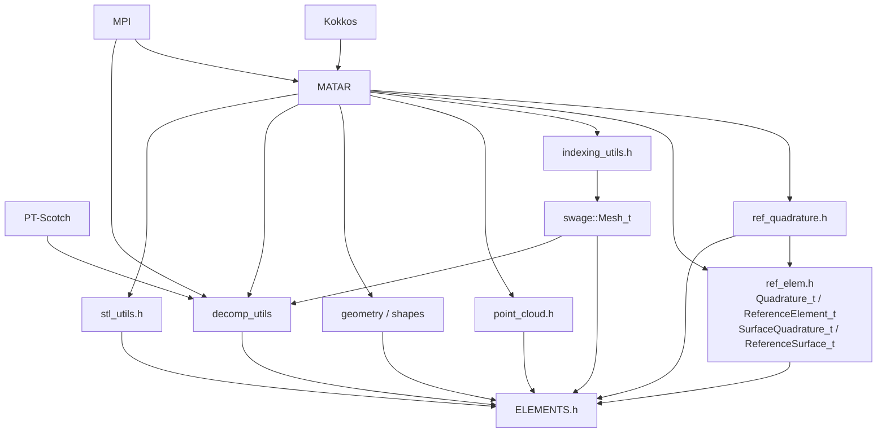
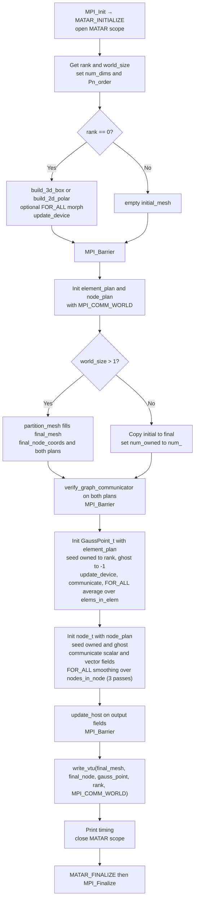

# ELEMENTS Code Context Reference

This document is an AI-agent skill for the [ELEMENTS](https://github.com/lanl/ELEMENTS) C++ library. It provides the public API, mental model, conventions, pitfalls, and end-to-end usage patterns required to write correct code against ELEMENTS, plus a maintainer-oriented section for editing the library itself.

ELEMENTS is built on top of [MATAR](https://github.com/lanl/MATAR). **This document assumes the MATAR skill is loaded separately** and only cross-references MATAR types/macros where an ELEMENTS-specific pattern requires it. Do not duplicate MATAR content here; consult the MATAR skill for `MATAR_INITIALIZE`, `FOR_ALL`, `CArrayDual`, `MPICArrayKokkos`, `CommunicationPlan`, fence rules, host/device sync, etc.

---

## Table of Contents

1. [Purpose and Prerequisites](#1-purpose-and-prerequisites)
2. [Setup and Boilerplate](#2-setup-and-boilerplate)
3. [Data Type Taxonomy](#3-data-type-taxonomy)
4. [Mesh Lifecycle (`swage::Mesh_t`)](#4-mesh-lifecycle-swagemesh_t)
5. [Reference Elements and Quadrature](#5-reference-elements-and-quadrature)
6. [Geometry Helpers (`geometry.h` / `shapes.h`)](#6-geometry-helpers-geometryh--shapesh)
7. [Mesh Decomposition Workflow](#7-mesh-decomposition-workflow)
8. [State and Halo Communication](#8-state-and-halo-communication)
9. [Mesh I/O Patterns](#9-mesh-io-patterns)
10. [End-to-End Walkthrough: `mesh_decomp_example.cpp`](#10-end-to-end-walkthrough-mesh_decomp_examplecpp)
11. [Common Pitfalls](#11-common-pitfalls)
12. [Maintainer / Internals](#12-maintainer--internals)
13. [Build and Configuration](#13-build-and-configuration)
14. [Testing](#14-testing)
15. [Ground Truth Constraints for LLMs](#15-ground-truth-constraints-for-llms)
16. [LLM Output Contract](#16-llm-output-contract)

---

## 1. Purpose and Prerequisites

ELEMENTS is a collection of small, header-only C++ sub-libraries for implementing low- and high-order numerical methods (continuous/discontinuous FEM, finite-volume) on 2D/3D unstructured meshes. The library is data-oriented: there are very few classes, mostly plain-old-data structs holding MATAR arrays and free functions that operate on them.

### Sub-libraries

| Sub-library | Header | Role |
|-------------|--------|------|
| **elements** | [src/elements/ref_elem.h](src/elements/ref_elem.h), [ref_quadrature.h](src/elements/ref_quadrature.h) | Reference element math: tensor-product Lagrange basis and quadrature, 1D/2D/3D. Volume: `Quadrature_t`, `ReferenceElement_t`. Surface (of a volume element): `SurfaceQuadrature_t`, `ReferenceSurface_t`. All in `namespace elements`, Gauss-Lobatto / Gauss-Legendre points. |
| **swage** | [src/swage/unstructured_mesh.h](src/swage/unstructured_mesh.h), [indexing_utils.h](src/swage/indexing_utils.h), [point_cloud.h](src/swage/point_cloud.h) | `swage::Mesh_t` — unstructured 2D/3D mesh of arbitrary order with full connectivity. `indexing_utils.h` supplies the local index-ordering helpers/functors (`zones_in_elem_t`, `gauss_in_elem_t`, `corners_in_elem_t`, `patches_in_surf_t`, `get_surf_node_lids`, `get_patch_node_lids`) and the `mesh_init::ElementNameType` enum. `point_cloud.h`'s `PointCloud_t` gives spatial-binning + neighbor connectivity for meshfree point clouds (SPH/RKPM). |
| **geometry** | [src/geometry/geometry.h](src/geometry/geometry.h), [shapes.h](src/geometry/shapes.h) | `jacobian(...)` (element Jacobian from node coords + grad basis) and `build_quadrature_point_connectivity(...)` (matches quadrature points across a shared surface), plus analytic primitives (`Plane`, `Circle`, `Sphere`) — the primitives are **not** finite-element shape functions |
| **decomp_utilities** | [src/decomp_utilities/decomp_utils.h](src/decomp_utilities/decomp_utils.h) | PT-Scotch mesh partitioning + ghost layers + MATAR `CommunicationPlan` setup |
| **utils** | [src/utils/stl_utils.h](src/utils/stl_utils.h) | `stl_data` — binary STL mesh reader (`binary_stl_reader`) plus an AABB tree (`buildAABBTree`/`verifyAABBTree`/`query_nearest_facet`) for nearest-facet queries against an STL surface (used for e.g. computing point-in/out or nearest-surface distance) |

The single umbrella header [src/ELEMENTS.h](src/ELEMENTS.h) pulls everything in.

### Sub-library dependency graph



### Required prerequisite skills / knowledge

- **MATAR skill**: types like `CArrayKokkos`, `DCArrayKokkos`, `MPICArrayKokkos`, `RaggedRightArrayKokkos`, `CommunicationPlan`; macros `FOR_ALL`, `FOR_ALL_CLASS`, `FOR_REDUCE_*`, `MATAR_INITIALIZE`, `MATAR_FINALIZE`, `MATAR_FENCE`; the host/device dual-pattern and fence-placement rules.
- **MPI**: rank/size, `MPI_COMM_WORLD`, neighbor collectives. ELEMENTS' decomposition is hardcoded to `MPI_COMM_WORLD`.
- **PT-Scotch (optional)**: only if reading/modifying `decomp_utils.h` internals; consumers do not need to call Scotch directly.

### Namespaces used

| Namespace | Contents |
|-----------|----------|
| `mtr::` | All MATAR types and macros (brought in via `using namespace mtr;`) |
| `swage::` | `Mesh_t` (the central mesh struct) and the small index functor structs (`zones_in_elem_t`, `gauss_in_elem_t`, `corners_in_elem_t`, `patches_in_surf_t`) plus `PointCloud_t` |
| `elements::` | `partition_mesh`, `naive_partition_mesh`, `build_ghost`; `Quadrature_t`, `ReferenceElement_t`, `SurfaceQuadrature_t`, `ReferenceSurface_t`; the free quadrature helpers in `ref_quadrature.h` |
| `reference_space::` | `ElementType` (`linearElement`, `arbitraryOrderElement`), `BasisType` (`LagrangeLobatto`, `LagrangeLegendre`), `QuadratureType` (`GaussLobatto`, `GaussLegendre`) — used by `elements::Quadrature_t` / `ReferenceElement_t` |
| `geometry::` | `Plane`, `Circle`, `Sphere` |
| `mesh_init::` | `ElementNameType` enum (`linearTensorElement`, `arbitraryTensorElement`) |
| `mesh_input::` | `source` and `type` enums (used by example `mesh_input_t`) |

---

## 2. Setup and Boilerplate

### Single header for consumers

```cpp
#include "ELEMENTS.h"
```

This header includes MATAR plus every ELEMENTS sub-library header. See [src/ELEMENTS.h](src/ELEMENTS.h):

```1:22:src/ELEMENTS.h
#ifndef ELEMENTS_LIBRARY_H
#define ELEMENTS_LIBRARY_H

// --- Core Dependencies ---
#include "matar.h"

// --- Swage Headers (Mesh & Core) ---
#include "swage/unstructured_mesh.h"
#include "swage/point_cloud.h"
#include "elements/ref_elem.h"
#include "elements/ref_quadrature.h"


// --- Decomp Utilities ---
#include "decomp_utilities/decomp_utils.h"

// --- Geometry Headers ---
#include "geometry/geometry.h"

// --- STL Utilities ---
#include "utils/stl_utils.h"

#endif // ELEMENTS_LIBRARY_H
```

Note: `decomp_utilities/decomp_utils.h` pulls in `<mpi.h>`, `scotch.h`, and `ptscotch.h` — anything that includes the umbrella `ELEMENTS.h` needs MPI and PT-Scotch available at compile time. Most sub-headers (`elements/ref_elem.h`, `swage/unstructured_mesh.h`, `swage/point_cloud.h`, `utils/stl_utils.h`) are self-contained on top of MATAR and can be included directly for a narrower build that skips MPI/Scotch. **`geometry/geometry.h` is the one exception**: its own first include is `#include "ELEMENTS.h"` (guarded, so no infinite recursion, but it means including `geometry.h` alone still drags in the whole umbrella — `swage`, `decomp_utilities`, MPI, and PT-Scotch — because `ELEMENTS.h` in turn includes `geometry.h`). Do not assume including `geometry.h` narrows your dependency footprint.

### Initialization order is critical

For MPI programs, **`MPI_Init` must come before `MATAR_INITIALIZE`** and **`MPI_Finalize` must come after `MATAR_FINALIZE`**. The MATAR scope braces must enclose every MATAR-owned object so destructors run before `MATAR_FINALIZE`.

#### Template A — serial / single-rank ELEMENTS program

```cpp
// COMPILES_AS_IS (assuming you fill in the body)
#include "ELEMENTS.h"

using namespace mtr;

int main(int argc, char** argv) {
    MATAR_INITIALIZE(argc, argv);
    { // MATAR scope
        // Build a swage::Mesh_t, call build_connectivity, do work.
        // All MATAR/ELEMENTS objects must live INSIDE this scope.
    }
    MATAR_FINALIZE();
    return 0;
}
```

#### Template B — MPI / multi-rank ELEMENTS program

```cpp
// COMPILES_AS_IS (assuming you fill in the body)
#include <mpi.h>
#include "ELEMENTS.h"
#include "state.h"     // node_t, GaussPoint_t, State_t  (from examples/*/include)
#include "mesh_io.h"   // build_3d_box, write_vtu        (from examples/*/include)

using namespace mtr;

int main(int argc, char** argv) {
    MPI_Init(&argc, &argv);
    MATAR_INITIALIZE(argc, argv);
    { // MATAR scope
        int rank, size;
        MPI_Comm_rank(MPI_COMM_WORLD, &rank);
        MPI_Comm_size(MPI_COMM_WORLD, &size);

        swage::Mesh_t initial_mesh;
        MPICArrayKokkos<double> initial_node_coords;
        // ... build on rank 0, partition, communicate ...
    }
    MATAR_FINALIZE();
    MPI_Finalize();
    return 0;
}
```

The decomp example shows the canonical ordering:

```32:36:examples/decomp_example/src/mesh_decomp_example.cpp
int main(int argc, char** argv) {

    MPI_Init(&argc, &argv);
    MATAR_INITIALIZE(argc, argv);
    { // MATAR scope
```

```294:297:examples/decomp_example/src/mesh_decomp_example.cpp
    } // end MATAR scope
    MATAR_FINALIZE();
    MPI_Finalize();

    return 0;
```

### `state.h` and `mesh_io.h` are example infrastructure, not library headers

The structs `node_t`, `GaussPoint_t`, `State_t`, the input-deck `mesh_input_t`, and the I/O functions (`build_3d_box`, `build_2d_polar`, `write_vtu`, `write_vtk`, `read_vtk_mesh`) live in [examples/decomp_example/include/](examples/decomp_example/include/) and [examples/average/include/](examples/average/include/). They are not part of the installed library. Treat them as **reference implementations** that downstream applications copy and adapt, and cite the example file path when generating code that depends on them.

---

## 3. Data Type Taxonomy

ELEMENTS exposes a small set of user-facing types. Use this table to pick the right one.

### Mesh and state

| Type | Defined in | Role |
|------|------------|------|
| `swage::Mesh_t` | [src/swage/unstructured_mesh.h](src/swage/unstructured_mesh.h) | The mesh: counts, connectivity, MPI ownership metadata. Two mutually exclusive init paths (linear vs arbitrary-order tensor). |
| `node_t` | [examples/*/include/state.h](examples/decomp_example/include/state.h) | Per-node state wrapper holding `MPICArrayKokkos<double>` for `coords`, `coords_n0`, `scalar_field`, `vector_field`. |
| `GaussPoint_t` | [examples/*/include/state.h](examples/decomp_example/include/state.h) | Per-cell/Gauss-point state: `MPICArrayKokkos<double>` for `fields` and `fields_vec`. |
| `State_t` | [examples/*/include/state.h](examples/decomp_example/include/state.h) | Bundle: `node_t node;` + `GaussPoint_t GaussPoints;`. |
| `mesh_input_t` | [examples/*/include/mesh_inputs.h](examples/decomp_example/include/mesh_inputs.h) | Input-deck struct: `num_dims`, `source`, `file_path`, `type`, `origin[3]`, `length[3]`, `num_elems[3]`, `p_order`, polar params, scale, `object_ids`. |

### Reference element / quadrature

All four types below live in `namespace elements` in [src/elements/ref_elem.h](src/elements/ref_elem.h) and support `elem_dims` (`num_dims`) of 1, 2, **or** 3 — there is no 3D-only restriction.

| Type / function | Defined in | Role |
|-----------------|------------|------|
| `elements::Quadrature_t` | [src/elements/ref_elem.h](src/elements/ref_elem.h) | Volume quadrature rule. `initialize_quadrature(reference_space::QuadratureType, size_t num_qpts_1d, size_t elem_dims)` builds `qpt_positions` `(num_qpts_in_elem, elem_dims)` and `qpt_weights` `(num_qpts_in_elem,)` as a tensor product of the 1D rule. |
| `elements::ReferenceElement_t` | [src/elements/ref_elem.h](src/elements/ref_elem.h) | Volume reference element (DOF positions + basis/grad-basis at quadrature points). `initialize_ref_elem(reference_space::ElementType, reference_space::BasisType, const Quadrature_t&, size_t p_order)`. Populates `dof_positions`, `dof_positions_1d`, `qpt_basis` `(num_qpts_in_elem, num_dofs_in_elem)`, `qpt_grad_basis` `(num_qpts_in_elem, num_dofs_in_elem, elem_dims)`. |
| `elements::SurfaceQuadrature_t` | [src/elements/ref_elem.h](src/elements/ref_elem.h) | Quadrature rule on each of the `2*elem_dims` reference-element faces. `initialize_quadrature(reference_space::QuadratureType, size_t num_qpts_1d, size_t elem_dims)`; `qpt_positions` `(num_ref_surfs, num_qpts_in_surf, elem_dims)`, `qpt_weights` `(num_ref_surfs, num_qpts_in_surf)`. |
| `elements::ReferenceSurface_t` | [src/elements/ref_elem.h](src/elements/ref_elem.h) | Basis/grad-basis of the volume element evaluated at each face's quadrature points, plus outward normals. `initialize_ref_surf(const SurfaceQuadrature_t&, const ReferenceElement_t&)`. Populates `qpt_basis` `(faces, surf_qpts, dofs)`, `qpt_grad_basis` `(faces, surf_qpts, dofs, dims)`, `outward_sign`, `outward_normal`. Used by `build_quadrature_point_connectivity` in [src/geometry/geometry.h](src/geometry/geometry.h) to match quadrature points across a shared surface — this is live, working code (not a stub). |
| `elements::get_lobatto_nodes_1D`, `get_lobatto_weights_1D`, `get_legendre_nodes_1D`, `get_legendre_weights_1D` | [src/elements/ref_quadrature.h](src/elements/ref_quadrature.h) | Free `static KOKKOS_FUNCTION` helpers that fill a pre-allocated `CArrayKokkos<double>` with 1D quadrature data. Stateless. Called internally by `Quadrature_t`/`ReferenceElement_t`/`SurfaceQuadrature_t`; rarely called directly by consumers. |

### Point cloud / spatial binning

| Type | Defined in | Role |
|------|------------|------|
| `swage::PointCloud_t` | [src/swage/point_cloud.h](src/swage/point_cloud.h) | Spatial-binning + point-to-point neighbor connectivity for meshfree methods (SPH, RKPM). `initialize_point_cloud_vars(search_radius, min_num_points_fit)` sets the kernel support radius; `build_bin_mesh(...)` builds a uniform structured bin grid over the point positions; `build_point_cloud_connectivity(point_positions)` fills `points_in_point` (ragged neighbor list within `search_radius`) and `points_num_neighbors`; `get_points_in_box(...)` queries points inside an AABB; `build_shared_node_connectivity(...)` detects coincident/overlapping points within `coincident_tol`. |

### STL / geometry queries

| Type | Defined in | Role |
|------|------------|------|
| `stl_data` | [src/utils/stl_utils.h](src/utils/stl_utils.h) | Loaded binary-STL surface mesh: `num_facets`, `normal`/`vertices`/`center` (`DCArrayKokkos<float>`), global bounding box, plus an AABB tree (`tree_nodes`, `sorted_facet_indices`, `root_idx`). Populate via `binary_stl_reader(std::string stl_file_path, stl_data& stl_data)`, then `buildAABBTree()` to accelerate queries; `verifyAABBTree()` sanity-checks the tree; `query_nearest_facet(const float p[3], ...)` finds the closest STL facet to an arbitrary point (nearest-surface distance / point classification queries). |

### Analytic geometry

| Type | Defined in | Role |
|------|------------|------|
| `geometry::Plane` | [src/geometry/shapes.h](src/geometry/shapes.h) | Infinite plane; method `is_point_on_plane(point)`. |
| `geometry::Circle` | [src/geometry/shapes.h](src/geometry/shapes.h) | Circle in space; method `is_point_on_circle(point)`. |
| `geometry::Sphere` | [src/geometry/shapes.h](src/geometry/shapes.h) | 3D sphere; methods `is_point_on_sphere`, `is_point_inside_sphere`, `signed_distance_to_sphere`. |

These are **analytic predicates**, not finite-element shape functions. There is no `Hex8`, `Tet4`, `Quad4`, etc. in this library.

### Decomposition entry points

| Function | Defined in | Role |
|----------|------------|------|
| `elements::naive_partition_mesh(...)` | [src/decomp_utilities/decomp_utils.h](src/decomp_utilities/decomp_utils.h) | Round-robin scatter from rank 0 to all ranks (no Scotch). |
| `elements::partition_mesh(...)` | [src/decomp_utilities/decomp_utils.h](src/decomp_utilities/decomp_utils.h) | High-level driver: naive partition → PT-Scotch → redistribute → ghost layer. The function consumers normally call. |
| `elements::build_ghost(...)` | [src/decomp_utilities/decomp_utils.h](src/decomp_utilities/decomp_utils.h) | Identifies shared/ghost entities and fills two `CommunicationPlan`s (element + node). |

### MATAR types you will see most

The MATAR types most frequently used in ELEMENTS code (full reference in the MATAR skill):

| Type | Used for |
|------|---------|
| `DCArrayKokkos<size_t>` | Connectivity tables (`nodes_in_elem`, `local_to_global_*_mapping`, boundary IDs). Dual host/device. |
| `CArrayKokkos<size_t>` / `CArrayKokkos<double>` | Stride arrays, surface/patch lists, basis tables, quadrature points. Device. |
| `RaggedRightArrayKokkos<size_t>` | Variable-length adjacency: `elems_in_elem`, `corners_in_node`, `nodes_in_node`, `bdy_patches_in_set`. |
| `MPICArrayKokkos<double>` | Halo-aware fields: node coordinates, `node_t` / `GaussPoint_t` members. Wraps a `DCArrayKokkos` and a `CommunicationPlan`. |
| `CArrayDual<int>` | Small two-sided arrays used during partitioning (`elems_in_elem_on_rank`). |
| `CommunicationPlan` | MPI neighbor topology; one for elements, one for nodes. |
| `ViewCArrayKokkos<double>` | Used by `geometry::Plane/Circle/Sphere` to wrap caller-owned coordinate buffers. |

---

## 4. Mesh Lifecycle (`swage::Mesh_t`)

### The struct is `swage::Mesh_t`

The type is declared as `struct Mesh_t` inside `namespace swage`, and the closing comment (`}; // end Mesh_t`) now agrees with the type name — there is no separate `mesh_t` typedef and no naming mismatch to work around. Always type `swage::Mesh_t`.

```70:88:src/swage/unstructured_mesh.h
struct Mesh_t
{

    bool verbose = false;

    // ---- Global Mesh Definitions ---- //
    mesh_init::ElementNameType elem_kind = mesh_init::linearTensorElement; ///< The type of elements used in the mesh

    size_t Pn = 1;       ///< Polynomial order of kinematic space defining element
    size_t num_dims = 0; ///< Number of spatial dimension
```

The struct-level doc comment defines the entity vocabulary:

```
Mesh entity definitions:
    Element: Aribtrary-order hexahedral or quadralateral volume
    Zone:    A discretization of an element by subdividing it using the nodes
             The zone has 8 nodes (3D) or 4 nodes (2D) for any order mesh
    Node:    A kinematic degree of freedom
    Corner:  A element-node pair
    Surface: The surface of the element, it is one dimension lower than the volume
    Patch:   A discretization of a surface by subdividing it using the nodes
    Face:    The local surface entity of the Element, equal to 6 (3D) or 4 (2D)
    Side:    A element-surface pair -- not in the mesh type at this time
```

### Entity vocabulary

| Entity | Meaning | Notes |
|--------|---------|-------|
| **Element** | Arbitrary-order hex (3D) or quad (2D) volume | Index variable: `elem_gid`. The primary volumetric unit. |
| **Node** | Kinematic DOF | Index: `node_gid`. For high-order meshes there are many nodes per element, not just 8 vertices. `num_nodes_in_elem = (Pn+1)^num_dims` for arbitrary-order; `2^num_dims` for linear. |
| **Zone** | Subcell partition of an element, always 8 nodes (3D) / 4 nodes (2D) regardless of order | `num_zones_in_elem = Pn^num_dims`. Built by the separate, opt-in `build_zones()` method (not part of `build_connectivity()`). |
| **Face** | Local surface entity of the element | Count `num_surfs_in_elem` = `2*num_dims` (4 in 2D, 6 in 3D); local index `face_lid`. |
| **Surface** | The mesh-level (shared) instance of a face — one dimension lower than the volume | Built by `build_surf_connectivity()`; `nodes_in_surf`, `elems_in_surf`, `faces_in_surf`, `num_elems_in_surf` (1 on a boundary, 2 interior). |
| **Patch** | Subdivision of a surface using the nodes | `num_nodes_in_patch` (2 in 2D, 4 in 3D). Built alongside surfaces inside `build_surf_connectivity()`. |
| **Corner** | (element, local-node) pair | Global corner id = `elem_gid * num_nodes_in_elem + node_lid`, computed by the `corners_in_elem_t` functor (not a stored array). |
| **Gauss point** | Volume quadrature point | `gauss_in_elem(elem_gid, gauss_lid) →` global Gauss id; populated via the `gauss_in_elem_t` functor. |

There is no `lobatto_in_elem` functor on `Mesh_t` today — Lobatto/DOF point bookkeeping lives on the reference-element types (`elements::ReferenceElement_t`, Section 5), not on the mesh.

The element-formulation tag lives in `mesh_init` in [src/swage/indexing_utils.h](src/swage/indexing_utils.h) (not `unstructured_mesh.h`):

```39:47:src/swage/indexing_utils.h
namespace mesh_init
{
    // element mesh types
    enum ElementNameType
    {
        linearTensorElement = 1,   // single quadrature point element
        arbitraryTensorElement = 2 // fully integrated arbitrary-order element
    };

    // other enums could go here on the mesh
} // end namespace
```

There is no simplex value — only `linearTensorElement` and `arbitraryTensorElement` exist. `Mesh_t::elem_kind` defaults to `mesh_init::linearTensorElement`; `initialize_elems_Pn` is the only method that switches it to `mesh_init::arbitraryTensorElement`. `build_surf_connectivity` (via `get_surf_node_lids`/`get_patch_node_lids` in `indexing_utils.h`) branches on `elem_kind` between linear-tensor (hex/quad with fixed local-node tables) and arbitrary-tensor (Pn-order, tensor indexing).

### Hex node ordering (linear, 0-7)

The hex/quad local-node-ordering diagram now lives in [src/swage/indexing_utils.h](src/swage/indexing_utils.h) (it moved out of `unstructured_mesh.h`):

```55:107:src/swage/indexing_utils.h
    3D:

                  K
                  ^         J
                  |        /
                  |       /
                  |      /
          6------------------7
         /|                 /|
        / |                / |
       /  |               /  |
      /   |              /   |
     /    |             /    |
    4------------------5     |
    |     |            |     | ----> I
    |     |            |     |
    |     |            |     |
    |     |            |     |
    |     2------------|-----3
    |    /             |    /
    |   /              |   /
    |  /               |  /
    | /                | /
    |/                 |/
    0------------------1

    nodes are ordered for outward normal
    patch 0: [0,4,6,2]  xi-minus dir
    patch 1: [1,3,7,5]  xi-plus  dir
    patch 2: [0,1,5,4]  eta-minus dir
    patch 3: [3,2,6,7]  eta-plus  dir
    patch 4: [0,2,3,1]  zeta-minus dir
    patch 5: [4,5,7,6]  zeta-plus  dir

    2D linear element, 1 Quadrature Point:

       J
       ^
       |
     3---2
     |   |  --> I
     0---1

    patch 0: [0, 3]  xi-minus dir
    patch 1: [1, 2]  xi-plus  dir
    patch 2: [0, 1]  eta-minus dir
    patch 3: [3, 2]  eta-plus  dir
```

(This corrects a stale "patch 6" typo that used to appear in place of "patch 5" for the zeta-plus face — the current source numbers all six 3D patches 0-5.) This is **not** standard VTK or Ensight order. The `mesh_io.h` readers/writers in the examples include explicit reordering tables (e.g. an "Ensight to IJK" permutation in `read_vtk_mesh`).

### Mesh build protocol

The lifecycle is a strict ordered protocol. You must:

1. Call `initialize_dims(num_dims)` **first** — nearly every other method (`initialize_nodes`, `initialize_elems*`, all `build_*`) calls `Kokkos::abort(...)` if `num_dims == 0`.
2. Choose **exactly one** of `initialize_elems(num_elems)` or `initialize_elems_Pn(num_elems, Pn_order, num_gauss_1D)`.
3. Call `initialize_nodes(num_nodes)`.
4. Fill `nodes_in_elem` with **global** node IDs.
5. Call `build_connectivity()` (or the individual `build_*` methods in order).

```mermaid
flowchart TD
    A[initialize_dims&#40;num_dims&#41;] --> B{Linear or arbitrary order?}
    B -- "linear/one Gauss pt" --> C[initialize_elems&#40;num_elems&#41;]
    B -- "arbitrary order Pn" --> D[initialize_elems_Pn&#40;num_elems, Pn_order, num_gauss_1D&#41;]
    C --> N[initialize_nodes&#40;num_nodes&#41;]
    D --> N
    N --> E[Fill nodes_in_elem&#40;elem_gid, node_lid&#41;<br/>with global node IDs]
    E --> F[build_connectivity&#40;&#41;]
    F --> G[build_corner_connectivity]
    G --> H[build_elem_elem_connectivity]
    H --> I[build_surf_connectivity]
    I --> J[build_node_node_connectivity]
```



`build_connectivity()` runs four sub-builds in this fixed order (renamed from the old `build_patch_connectivity` to `build_surf_connectivity`, which now builds surfaces **and** patches together):

```1121:1138:src/swage/unstructured_mesh.h
    void build_connectivity()
    {
        if (num_dims == 0) {
            Kokkos::abort("Error: mesh.num_dims is not set. Exiting at build_connectivity().");
        }
        build_corner_connectivity();
        if (verbose) printf("Built corner connectivity \n");

        build_elem_elem_connectivity();
        if (verbose) printf("Built element-element connectivity \n");

        build_surf_connectivity();
        if (verbose) printf("Built surface and patch connectivity \n");

        build_node_node_connectivity();
        if (verbose) printf("Built node-node connectivity \n");
    }
```

Always prefer `build_connectivity()` over calling the individual `build_*` functions unless you have a specific reason. The functions have ordering dependencies (`elem_elem` requires `corner`; `surf` requires `elem_elem`; `node_node` requires `surf`), and `build_surf_connectivity` / `build_node_node_connectivity` explicitly `Kokkos::abort` if you call them before their prerequisite has run.

**`build_connectivity()` no longer flips `verbose` as a side effect** — `verbose` defaults to `false` and stays whatever the caller set it to. (This differs from older builds of ELEMENTS, where `build_connectivity()` unconditionally set `verbose = true`; do not rely on that behavior any more.)

`build_zones()` (fills `nodes_in_zone`) is a separate, opt-in call — it is **not** invoked by `build_connectivity()`. Call it yourself if your scheme needs zone-level bookkeeping.

### Linear vs arbitrary-order init

```232:265:src/swage/unstructured_mesh.h
    void initialize_elems(const size_t num_elems_inp)
    {

        if (num_dims == 0) {
            Kokkos::abort("Error: mesh.num_dims is not set. Exiting at initialize_elems().");
        }

        // --- Basic element bookkeeping ---
        num_elems = num_elems_inp;

        // initializes a linear element with a single gauss point for saving results
        Pn = 1;

        //Note: elem_kind is set to this type by default

        // --- Derived sizes ---
        num_nodes_in_elem = (size_t)std::pow(2, num_dims);
        num_nodes_in_zone = (size_t)std::pow(2, num_dims); // (4, or 8, always)
        num_gauss_in_elem = 1;  // 1 Gauss point per element
        num_zones_in_elem = 1;  // 1 zone per element
        num_surfs_in_elem = num_dims == 2 ? 4 : 6; // 4 or 6 (always)
        num_zones = num_zones_in_elem * num_elems;

        num_corners = num_nodes_in_elem*num_elems;

        // --- Allocations ---
        nodes_in_elem    = DCArrayKokkos<size_t>(num_elems, num_nodes_in_elem, "mesh.nodes_in_elem");
        corners_in_elem  = corners_in_elem_t(num_nodes_in_elem);
        gauss_in_elem    = gauss_in_elem_t(num_gauss_in_elem);
        zones_in_elem    = zones_in_elem_t(num_zones_in_elem);
        surfs_in_elem    = CArrayKokkos<size_t>(num_elems, num_surfs_in_elem, "mesh.surfs_in_zone");

        return;
    }; // end method
```

```268:319:src/swage/unstructured_mesh.h
    void initialize_elems_Pn(
        const size_t num_elems_inp,
        const size_t elem_Pn_order,
        const size_t num_gauss_1D)
    {
        // Note: num_gauss_1D creates an index space that can be used to register state on

        if (num_dims == 0) {
            Kokkos::abort("Error: mesh.num_dims is not set. Exiting at initialize_elems_Pn().");
        }

        // --- Set element details ---
        Pn = elem_Pn_order; // Note: element Pn_order = dofs_1D-1, where dofs are the element nodes
        if (elem_Pn_order == 0) {
            Kokkos::abort("Error: Pn must be greater than 0. Exiting at initialize_elems_Pn().");
        }

        num_elems = num_elems_inp;
        if (num_elems == 0) {
            Kokkos::abort("Error: num_elems must be greater than 0. Exiting at initialize_elems_Pn().");
        }

        elem_kind = mesh_init::arbitraryTensorElement;

        // --- Derived sizes ---
        num_gauss_in_elem = (size_t)std::pow(num_gauss_1D, num_dims); // Note: 2*Pn with Legendre is needed for solids mechanics
        num_nodes_in_elem = (size_t)std::pow(Pn + 1, num_dims);
        num_nodes_in_zone = (size_t)std::pow(2, num_dims);   // (4, or 8, always)
        num_zones_in_elem = (size_t)std::pow(Pn, num_dims);  // Pn^dim
        num_surfs_in_elem = num_dims == 2 ? 4 : 6;           // 4 or 6 (always)
        num_zones = num_zones_in_elem * num_elems;

        num_corners = num_nodes_in_elem*num_elems;

        // --- Allocations ---
        nodes_in_elem    = DCArrayKokkos<size_t>(num_elems, num_nodes_in_elem, "mesh.nodes_in_elem");
        corners_in_elem  = corners_in_elem_t(num_nodes_in_elem);
        zones_in_elem    = zones_in_elem_t(num_zones_in_elem);
        surfs_in_elem    = CArrayKokkos<size_t>(num_elems, num_surfs_in_elem, "mesh.surfs_in_zone");
        nodes_in_zone    = CArrayKokkos<size_t>(num_zones, num_nodes_in_zone, "mesh.nodes_in_zone");
        gauss_in_elem    = gauss_in_elem_t(num_gauss_in_elem);

        return;
    }; // end method
```

**Both signatures changed from older ELEMENTS versions**: neither `initialize_elems` nor `initialize_elems_Pn` takes a `num_dims` argument any more — `num_dims` must already be set via `initialize_dims()` before either is called (both `Kokkos::abort` otherwise). `initialize_elems_Pn`'s third argument is `num_gauss_1D` (the number of Gauss points per direction — often `2*Pn_order` for solid mechanics, per the source comment), **not** a repeat of `Pn_order`. Choose based on whether the element is linear/single-Gauss-point (`initialize_elems`) or arbitrary order (`initialize_elems_Pn`). Mixing the two on the same `Mesh_t` is undefined — `initialize_elems` does not set `elem_kind = mesh_init::arbitraryTensorElement` and does not allocate `nodes_in_zone`.

Also note `corners_in_elem` is constructed as a `corners_in_elem_t` **functor** (like `zones_in_elem_t` / `gauss_in_elem_t`), not a plain `CArrayKokkos` you index directly with stored data — see "Index functors" below.

### Filling `nodes_in_elem`

After init, write into `nodes_in_elem` on the host using `.host(elem_gid, node_lid) = node_gid` (it is a `DCArrayKokkos<size_t>`), or fill it directly on device with a `FOR_ALL` (as `tests/test_cases/test_mesh_connectivity.cpp` does) followed by `nodes_in_elem.update_host()`. The example builders (`build_3d_box`, `build_2d_polar`) handle this for you — see the `mesh_io.h` reference in [examples/decomp_example/include/mesh_io.h](examples/decomp_example/include/mesh_io.h).

### Connectivity arrays (read-only after build)

| Name | Type | Shape / meaning |
|------|------|-----------------|
| `nodes_in_elem` | `DCArrayKokkos<size_t>` | `(num_elems, num_nodes_in_elem)` — global node IDs |
| `corners_in_elem` | `corners_in_elem_t` (functor) | `(elem_gid, corner_lid) → elem_gid*num_nodes_in_elem + corner_lid` |
| `corners_in_node` | `RaggedRightArrayKokkos<size_t>` | per node, list of corner GIDs |
| `num_corners_in_node` | `CArrayKokkos<size_t>` | `(num_nodes,)` |
| `elems_in_node` | `RaggedRightArrayKokkos<size_t>` | per node, elements touching it |
| `elems_in_elem` | `RaggedRightArrayKokkos<size_t>` | per element, neighboring element GIDs |
| `num_elems_in_elem` | `CArrayKokkos<size_t>` | per-element neighbor counts |
| `nodes_in_node` | `RaggedRightArrayKokkos<size_t>` | per node, neighbor nodes along edges |
| `num_nodes_in_node` | `CArrayKokkos<size_t>` | per-node neighbor counts |
| `patches_in_elem`, `surfs_in_elem` | `CArrayKokkos<size_t>` | element-side patch/surface tables |
| `nodes_in_patch`, `elems_in_patch`, `surf_in_patch` | `CArrayKokkos<size_t>` / `patches_in_surf_t` | patch-side connectivity |
| `nodes_in_surf`, `faces_in_surf` | `CArrayKokkos<size_t>` / `CArrayKokkos<int>` | surface-side connectivity |
| `elems_in_surf`, `num_elems_in_surf` | `CArrayKokkos<int>` / `CArrayKokkos<size_t>` | elements touching a surface (`num_elems_in_surf` is 1 on the boundary, 2 interior) |
| `nodes_in_zone` | `CArrayKokkos<size_t>` | `(num_zones, num_nodes_in_zone)` — only filled by the separate `build_zones()` call |
| `bdy_surfs`, `bdy_patches`, `bdy_nodes` | `CArrayKokkos<size_t>` | flat boundary lists |
| `bdy_patches_in_set`, `bdy_nodes_in_set` | `RaggedRightArrayKokkos<size_t>` | per boundary set; **populated by application code (see comment in `initialize_bdy_sets`), not by `build_connectivity`** |

### Index functors

`zones_in_elem`, `gauss_in_elem`, `corners_in_elem` (all `Mesh_t` members) and `patches_in_surf` are not arrays — they are tiny stride-flattening structs defined in [src/swage/indexing_utils.h](src/swage/indexing_utils.h):

```148:172:src/swage/indexing_utils.h
struct zones_in_elem_t
{
    private:
        size_t num_zones_in_elem_;
    public:
        zones_in_elem_t() {
        };

        zones_in_elem_t(const size_t num_zones_in_elem_inp) {
            this->num_zones_in_elem_ = num_zones_in_elem_inp;
        };

        // return global zone index for given local zone index in an element
        size_t host(const size_t elem_gid, const size_t zone_lid) const
        {
            return elem_gid * num_zones_in_elem_ + zone_lid;
        };

        // Return the global zone ID given an element gloabl ID and a local zone ID
        KOKKOS_INLINE_FUNCTION
        size_t operator()(const size_t elem_gid, const size_t zone_lid) const
        {
            return elem_gid * num_zones_in_elem_ + zone_lid;
        };
};
```

Use them as `mesh.zones_in_elem(elem_gid, zone_lid)` inside device kernels and `mesh.zones_in_elem.host(elem_gid, zone_lid)` on the host. `gauss_in_elem_t`, `corners_in_elem_t`, and `patches_in_surf_t` all follow the exact same `elem_gid/surf_gid * stride + local_id` pattern (see `src/swage/indexing_utils.h:175-254`).

### Boundary sets

```cpp
// COMPILES_AS_IS (after building mesh)
mesh.initialize_bdy_sets(num_bcs);
// At this point only num_bdy_sets and num_bdy_patches_in_set are allocated.
// Filling bdy_patches_in_set and bdy_nodes_in_set is the application's job
// (see geometry_new.cpp pattern in the legacy code).
```

Note the method is `initialize_bdy_sets` (not `init_bdy_sets`). The header explicitly defers ragged boundary set construction to a `tag_bdys`-style function written outside `swage::Mesh_t`. Do not assume `build_connectivity` populates these.

### MPI ownership fields (filled by `decomp_utils`)

After a successful call to `elements::partition_mesh`, the `final_mesh` will have:

| Field | Meaning |
|-------|---------|
| `local_to_global_node_mapping` | `DCArrayKokkos<size_t>`, length `num_nodes` |
| `local_to_global_elem_mapping` | `DCArrayKokkos<size_t>`, length `num_elems` |
| `num_owned_elems` / `num_owned_nodes` | Count of owned (non-ghost) entities; ranks `[0, num_owned_*)` are owned, `[num_owned_*, num_*)` are ghost |
| `num_boundary_elems` / `num_boundary_nodes` | Count of locally-owned entities that are sent to neighbors |
| `boundary_elem_local_ids` | `DCArrayKokkos<size_t>` of local element IDs that send data. There is no `boundary_node_local_ids` field on `Mesh_t` today (the node analog is commented out in the header); node-side send lists live on the node `CommunicationPlan`/field, not on the mesh struct. |
| `shared_tally_owned_nodes` | `DCArrayKokkos<bool>`, length `num_owned_nodes` — owned-node mask: `true` where this rank is the minimum MPI rank among the ranks that own the global node (i.e. this rank is the domain-tally contributor for that node). Use it to avoid double-counting shared nodes when reducing a nodal quantity across ranks. |
| `num_ghost_elems` / `num_ghost_nodes` | Count of received entities |

For a single-rank fallback (`world_size == 1`), set these manually:

```129:133:examples/decomp_example/src/mesh_decomp_example.cpp
        final_mesh = initial_mesh;
        final_mesh.num_owned_elems = initial_mesh.num_elems;
        final_mesh.num_owned_nodes = initial_mesh.num_nodes;
        final_node_coords = initial_node_coords;
```

---

## 5. Reference Elements and Quadrature

There is no `fe_ref_elem_t` or `fe_ref_surf_t` type in this library. All reference-element/quadrature types are `elements::Quadrature_t`, `elements::ReferenceElement_t`, `elements::SurfaceQuadrature_t`, and `elements::ReferenceSurface_t`, all defined in [src/elements/ref_elem.h](src/elements/ref_elem.h). All four support `elem_dims` of 1, 2, **or** 3 — reference-element math is not restricted to 3D.

### `elements::Quadrature_t` (volume quadrature)

Default-construct, then call `initialize_quadrature` exactly once:

```cpp
// COMPILES_AS_IS (assuming MATAR scope)
using namespace elements;

Quadrature_t quadrature;
quadrature.initialize_quadrature(reference_space::GaussLegendre, /*num_qpts_1d=*/3, /*elem_dims=*/3);
// quadrature.qpt_positions : CArrayKokkos<double> (num_qpts_in_elem, elem_dims)
// quadrature.qpt_weights   : CArrayKokkos<double> (num_qpts_in_elem,)
```

`num_qpts_in_elem = num_qpts_1d ^ elem_dims` (tensor product of the 1D rule built by `ref_quadrature.h`'s `get_legendre_*`/`get_lobatto_*` helpers). `QuadratureType` is `reference_space::GaussLegendre` or `reference_space::GaussLobatto`; any other value, or `num_qpts_1d == 0`, or `elem_dims` outside `{1,2,3}` throws `std::runtime_error`.

### `elements::ReferenceElement_t` (volume basis)

Companion structure for `swage::Mesh_t`. Default-construct, then call `initialize_ref_elem` once, passing in an already-initialized `Quadrature_t`:

```cpp
// COMPILES_AS_IS (assuming MATAR scope, `quadrature` from above)
using namespace elements;

ReferenceElement_t ref_elem;
ref_elem.initialize_ref_elem(reference_space::arbitraryOrderElement,
                             reference_space::LagrangeLobatto,
                             quadrature,
                             /*p_order=*/3);
// ref_elem.elem_dims taken from quadrature.elem_dims
// ref_elem.num_dofs_in_elem = (p_order+1)^elem_dims
// ref_elem.dof_positions       : CArrayKokkos<double> (num_dofs_in_elem, elem_dims)
// ref_elem.dof_positions_1d    : CArrayKokkos<double> (num_dofs_1d,)
// ref_elem.qpt_basis           : CArrayKokkos<double> (Quadrature.num_qpts_in_elem, num_dofs_in_elem)
// ref_elem.qpt_grad_basis      : CArrayKokkos<double> (Quadrature.num_qpts_in_elem, num_dofs_in_elem, elem_dims)
```

`BasisType` (`reference_space::LagrangeLobatto` or `reference_space::LagrangeLegendre`) picks where the DOFs sit; `ElementType` (`reference_space::linearElement` or `reference_space::arbitraryOrderElement`) is stored but does not itself change the fill logic. `initialize_ref_elem` throws if `Quadrature.elem_dims == 0` or `> 3`.

#### Free basis-evaluation helpers (`namespace elements`, in `ref_elem.h`)

These are the actual on-the-fly basis routines — they are free functions, not methods on `ReferenceElement_t`:

| Function | Purpose |
|----------|---------|
| `get_basis(basis, dof_positions_1d, val_1d, val_Nd, point)` | Tensor-product Lagrange basis value at an arbitrary `point`, for `elem_dims` 1/2/3 |
| `partial_xi_basis(partial_xi, dof_positions_1d, val_1d, val_Nd, Dval_1d, Dval_Nd, point)` | ∂/∂ξ of the basis |
| `partial_eta_basis(...)` | ∂/∂η (2D and 3D only) |
| `partial_mu_basis(...)` | ∂/∂μ (3D only) |
| `lagrange_basis_1D(interp, dof_positions_1d, x_point)` | 1D Lagrange interpolant at `x_point` |
| `lagrange_derivative_1D(derivative, dof_positions_1d, x_point)` | 1D Lagrange derivative at `x_point` |
| `get_basis_and_grad_basis(qpt_basis, qpt_grad_basis, qpt_positions, dof_positions_1d)` | Fills basis + grad-basis at every quadrature point in one call — this is what `ReferenceElement_t::initialize_ref_elem` and `ReferenceSurface_t::initialize_ref_surf` call internally |
| `get_qpt_rid(i, j, k, num_qpts_1d)` / `get_dof_rid(i, j, k, num_dofs_1d)` | Flat row-major index from tensor `(i,j,k)` (or `(i,j)` 2D overloads) |

The caller supplies workspace as `CArrayKokkos<double>`: `val_1d`/`Dval_1d` length `num_dofs_1d`; `val_Nd`/`Dval_Nd` shape `(num_dofs_1d, elem_dims)`; `point` length `elem_dims`; `basis`/`partial_xi`/etc. length `num_dofs_in_elem`.

### `elements::SurfaceQuadrature_t` and `elements::ReferenceSurface_t` (surface of a volume element)

Surface support is **fully implemented and actively used** — it is not a stub. `build_quadrature_point_connectivity` in [src/geometry/geometry.h](src/geometry/geometry.h) is a real, working consumer of `ReferenceSurface_t`.

```cpp
// COMPILES_AS_IS (assuming MATAR scope, `ref_elem` initialized above)
using namespace elements;

SurfaceQuadrature_t surf_quadrature;
surf_quadrature.initialize_quadrature(reference_space::GaussLegendre, /*num_qpts_1d=*/3, /*elem_dims=*/3);
// surf_quadrature.num_ref_surfs   = 2*elem_dims (6 in 3D, 4 in 2D)
// surf_quadrature.qpt_positions   : CArrayKokkos<double> (num_ref_surfs, num_qpts_in_surf, elem_dims)
// surf_quadrature.qpt_weights     : CArrayKokkos<double> (num_ref_surfs, num_qpts_in_surf)

ReferenceSurface_t ref_surf;
ref_surf.initialize_ref_surf(surf_quadrature, ref_elem);
// ref_surf.qpt_basis       : CArrayKokkos<double> (faces, surf_qpts, dofs)
// ref_surf.qpt_grad_basis  : CArrayKokkos<double> (faces, surf_qpts, dofs, dims)
// ref_surf.outward_sign    : CArrayKokkos<double> (num_ref_surfs,)   -1 on the "minus" face, +1 on "plus"
// ref_surf.outward_normal  : CArrayKokkos<double> (num_ref_surfs, elem_dims)
```

Face ordering matches the mesh's face convention: face 0/1 = ξ minus/plus, 2/3 = η minus/plus, 4/5 = μ (ζ) minus/plus. `initialize_ref_surf` throws if `elem_dims == 0` or `> 3`.

### `ref_quadrature.h` — free helpers

The header is a `namespace elements { ... }` of stateless `static KOKKOS_FUNCTION` writers that fill a pre-allocated 1D buffer:

```cpp
// PSEUDOCODE_PATTERN
using namespace mtr;
CArrayKokkos<double> nodes(N, "nodes_1D");
CArrayKokkos<double> weights(N, "weights_1D");

elements::get_lobatto_nodes_1D(nodes, N);
elements::get_lobatto_weights_1D(weights, N);

elements::get_legendre_nodes_1D(nodes, N);
elements::get_legendre_weights_1D(weights, N);
```

These are large hard-coded if-cascades on `N`. Supported `N` values are bounded by what is tabulated in the source — check [src/elements/ref_quadrature.h](src/elements/ref_quadrature.h) for the exact list before generating code with an unusual order.

---

## 6. Geometry Helpers (`geometry.h` / `shapes.h`)

[src/geometry/geometry.h](src/geometry/geometry.h) has two real functions in addition to the `shapes.h` primitives below: `jacobian(...)` and `build_quadrature_point_connectivity(...)`. Both are documented here first since older guidance for this library incorrectly claimed `jacobian()` did not exist — it does, and it is the standard way to get the element Jacobian from a `ReferenceElement_t`/`ReferenceSurface_t` grad-basis table.

### `jacobian(...)` — element Jacobian matrix

```23:49:src/geometry/geometry.h
template <typename T1, typename T2, typename T3, typename T4>
KOKKOS_INLINE_FUNCTION
void jacobian(
    const T1 &jacobian,         // e.g., ViewCArrayKokkos <double>
    const T2 &node_coords,      // e.g., DCArrayKokkos    <double>
    const T3 &nodes_in_an_elem, // e.g., ViewCArrayKokkos <size_t>
    const T4 &a_grad_basis){    // e.g., ViewCArrayKokkos <double>

    const size_t dims = a_grad_basis.dims(1);
    const size_t num_dofs_in_elem = nodes_in_an_elem.size();

    // Calculate Jacobian: J[i,j] = partial x_i/partial \xi_j
    for(size_t i = 0; i < dims; i++)
    for(size_t j = 0; j < dims; j++)
    for(size_t node_lid = 0; node_lid < num_dofs_in_elem; node_lid++){
        const size_t node_gid = nodes_in_an_elem(node_lid);
        jacobian(i, j) += node_coords(node_gid, i)*a_grad_basis(node_lid, j);
    }
} // end of jacobian function
```

`jacobian` is a `KOKKOS_INLINE_FUNCTION` template — call it from inside a device kernel (`FOR_ALL`) for one element at a time. `jacobian` (the output, `dims x dims`) and `node_coords` (global mesh node coordinates) are caller-allocated; `nodes_in_an_elem` is a per-element view (e.g. `ViewCArrayKokkos<size_t>(&mesh.nodes_in_elem(elem_gid,0), num_nodes_in_elem)`); `a_grad_basis` is a single quadrature point's `(num_dofs_in_elem, dims)` slice out of `ReferenceElement_t::qpt_grad_basis` (or `ReferenceSurface_t::qpt_grad_basis` for a surface quadrature point). The function zeros `jacobian` itself before accumulating — you do not need to pre-zero it.

### `build_quadrature_point_connectivity(...)` — match quadrature points across a shared surface

```78:81:src/geometry/geometry.h
inline void build_quadrature_point_connectivity(const swage::Mesh_t& Mesh,
                                                const elements::ReferenceSurface_t& RefSurf,
                                                CArrayKokkos<int>& surf_qpt_qpt_map,
                                                const DCArrayKokkos<double>& node_coords){
```

Given a built `swage::Mesh_t`, an initialized `elements::ReferenceSurface_t`, and the mesh node coordinates, this fills `surf_qpt_qpt_map(surf_gid, side, qpt_lid)` so that a quadrature point on one side of an interior surface can look up its physically-coincident quadrature point on the other side — the pattern a DG or cell-centered finite-volume Riemann solve needs. It `Kokkos::abort`s if it cannot find a matching point (physical coordinates equal to within `1e-16`), so both sides must share a consistent quadrature rule and node numbering.

`geometry::Plane`, `geometry::Circle`, `geometry::Sphere` are analytic primitives, not FE shapes. Each constructor takes `ViewCArrayKokkos<double>` views of caller-owned position (and normal/radius) buffers. All predicate methods are `KOKKOS_INLINE_FUNCTION` and assume 1D views with extents matching `num_dims`.

### Constructors

```cpp
// COMPILES_AS_IS (assuming MATAR scope)
using namespace mtr;

double pos_data[3]    = {0.0, 0.0, 0.0};
double normal_data[3] = {0.0, 0.0, 1.0};
ViewCArrayKokkos<double> pos(pos_data, 3);
ViewCArrayKokkos<double> normal(normal_data, 3);

geometry::Plane  plane(pos, normal);
geometry::Circle circle(pos, normal, /*radius=*/1.0);
geometry::Sphere sphere(pos, /*radius=*/1.0);
```

The `Plane` and `Circle` constructors normalize the supplied normal in place; if the input normal has zero length, `Plane` throws `std::runtime_error` while `Circle` falls back to `(1, 0, 0)`. `Sphere` requires `position.extent() == 3`.

### Predicates

| Method | Type | Notes |
|--------|------|-------|
| `Plane::is_point_on_plane(point)` | `bool` | `|n . (p - x0)| < epsilon` |
| `Circle::is_point_on_circle(point)` | `bool` | On plane AND distance < radius |
| `Sphere::is_point_on_sphere(point)` | `bool` | `|distance - radius| < epsilon` |
| `Sphere::is_point_inside_sphere(point)` | `bool` | `distance < radius` |
| `Sphere::signed_distance_to_sphere(point)` | `double` | `distance - radius` |

`epsilon` defaults to `1e-7` per object and is a public field if you need to override it before calling.

### What does NOT exist

There is no `Hex8`, `Tet4`, `Quad4`, `evaluate_basis(xi, eta)`, or `node_coords()` API in `geometry/`. Do not invent them. `jacobian(...)` and `build_quadrature_point_connectivity(...)` **do** exist (above) — do not claim otherwise. For FE basis evaluation use `elements::ReferenceElement_t` / `elements::ReferenceSurface_t` (Section 5).

---

## 7. Mesh Decomposition Workflow

`decomp_utils.h` provides three free functions in `namespace elements`. The one consumers normally call is `partition_mesh`; the other two are exposed building blocks.

### Three entry points

| Function | When to call |
|----------|-------------|
| `naive_partition_mesh` | Block-distribute global mesh (rank 0) into contiguous element ranges across all ranks. Minimal communication setup. Exposed mostly for `partition_mesh`'s internal use. |
| `partition_mesh` | The high-level driver. Handles naive partition → PT-Scotch repartition → halo construction → fills both `CommunicationPlan`s. **This is the one to call.** |
| `build_ghost` | Given an already-partitioned mesh, identify shared-boundary and ghost entities and populate two `CommunicationPlan`s. Called by `partition_mesh`. |

### `partition_mesh` signature

```1736:1744:src/decomp_utilities/decomp_utils.h
inline void partition_mesh(
    swage::Mesh_t& initial_mesh,
    swage::Mesh_t& final_mesh,
    MPICArrayKokkos<double>& initial_node_coords,
    MPICArrayKokkos<double>& final_node_coords,
    CommunicationPlan& element_communication_plan,
    CommunicationPlan& node_communication_plan,
    int world_size,
    int rank)
```

- `initial_mesh` / `initial_node_coords`: must be valid on rank 0; can be empty/default on other ranks.
- `final_mesh` / `final_node_coords`: outputs. Will be sized for owned + ghost entities on each rank.
- `element_communication_plan`, `node_communication_plan`: must be **already initialized** with `MPI_COMM_WORLD` (see workflow below). The function fills the rest.
- `world_size`, `rank`: from `MPI_Comm_size` / `MPI_Comm_rank`. The function uses **`MPI_COMM_WORLD` exclusively** internally; `world_size` and `rank` are passed for convenience, not for routing on a non-default communicator.

### Canonical workflow

```mermaid
flowchart TD
    A[MPI_Init then MATAR_INITIALIZE] --> B[Build initial_mesh on rank 0<br/>Build initial_node_coords on rank 0]
    B --> C[MPI_Barrier]
    C --> D[Construct two CommunicationPlans<br/>and call .initialize&#40;MPI_COMM_WORLD&#41;]
    D --> E{world_size > 1?}
    E -- "Yes" --> F[elements::partition_mesh&#40;...&#41;]
    E -- "No" --> G[final_mesh = initial_mesh<br/>num_owned_elems = num_elems<br/>num_owned_nodes = num_nodes<br/>final_node_coords = initial_node_coords]
    F --> H[verify_graph_communicator on both plans]
    G --> H
    H --> I[Initialize node_t / GaussPoint_t<br/>with the appropriate plan]
    I --> J[Compute, communicate, write VTU]
```



### Code template

```cpp
// PSEUDOCODE_PATTERN — fills in mesh build, communication, and output
#include <mpi.h>
#include "ELEMENTS.h"
#include "state.h"
#include "mesh_io.h"

using namespace mtr;

int main(int argc, char** argv) {
    MPI_Init(&argc, &argv);
    MATAR_INITIALIZE(argc, argv);
    {
        int rank, world_size;
        MPI_Comm_rank(MPI_COMM_WORLD, &rank);
        MPI_Comm_size(MPI_COMM_WORLD, &world_size);

        swage::Mesh_t initial_mesh;
        MPICArrayKokkos<double> initial_node_coords;

        if (rank == 0) {
            double origin[3] = {0.0, 0.0, 0.0};
            double length[3] = {1.0, 1.0, 1.0};
            int    nelems[3] = {20, 20, 20};
            int    Pn_order  = 3;
            build_3d_box(initial_mesh, initial_node_coords, origin, length, nelems, Pn_order);
        }
        MPI_Barrier(MPI_COMM_WORLD);

        CommunicationPlan element_plan;
        element_plan.initialize(MPI_COMM_WORLD);
        CommunicationPlan node_plan;
        node_plan.initialize(MPI_COMM_WORLD);

        swage::Mesh_t final_mesh;
        MPICArrayKokkos<double> final_node_coords;

        if (world_size != 1) {
            elements::partition_mesh(initial_mesh, final_mesh,
                                     initial_node_coords, final_node_coords,
                                     element_plan, node_plan,
                                     world_size, rank);
        } else {
            final_mesh = initial_mesh;
            final_mesh.num_owned_elems = initial_mesh.num_elems;
            final_mesh.num_owned_nodes = initial_mesh.num_nodes;
            final_node_coords = initial_node_coords;
        }

        // Now use final_mesh + element_plan / node_plan to allocate state and run.
    }
    MATAR_FINALIZE();
    MPI_Finalize();
    return 0;
}
```

### What happens inside `partition_mesh`

1. **`naive_partition_mesh`** scatters elements/connectivity/coordinates from rank 0 in contiguous blocks; produces a `naive_mesh` and CSR neighbor lists per local element.
2. **PT-Scotch** is initialized with `SCOTCH_dgraphInit(&dgraph, MPI_COMM_WORLD)`. The graph is built from the per-rank element CSR (`vertloctab` / `edgeloctab` containing global element IDs of neighbors). Strategy is `SCOTCH_STRATQUALITY` with imbalance ratio `0.001`, mapping to a `SCOTCH_archCmplt(arch, world_size)` complete-graph architecture.
3. **`SCOTCH_dgraphMap`** assigns each local element a destination rank in `partloctab`.
4. Elements, connectivity, and node coordinates are **redistributed** with `MPI_Alltoall` + `MPI_Alltoallv` into an `intermediate_mesh`. Then `intermediate_mesh.build_connectivity()` is called.
5. **`build_ghost`** identifies which owned elements/nodes are shared with which neighbor ranks, builds the ghost layer in `final_mesh`, and fills both `CommunicationPlan`s via `initialize_graph_communicator` + `setup_send_recv` (using `DRaggedRightArrayKokkos<int>` send/recv index lists).

After `partition_mesh` returns:
- `final_mesh.num_elems` = owned + ghost elements; `final_mesh.num_owned_elems` = owned only.
- Same for `num_nodes` / `num_owned_nodes`.
- Element local IDs `[0, num_owned_elems)` are owned, `[num_owned_elems, num_elems)` are ghost. Same for nodes.
- `local_to_global_*_mapping` is filled.
- Both `CommunicationPlan`s are ready to be attached to `MPICArrayKokkos` fields via `field.initialize_comm_plan(plan)`.

### PT-Scotch hard-codings to be aware of

- The communicator is **always** `MPI_COMM_WORLD`. Calling `partition_mesh` from inside a sub-communicator requires editing the source.
- The graph is **element-adjacency only** — no node-based partitioning, no weights.
- Architecture is always a complete graph of size `world_size` (one part per rank); cannot map to a hierarchical machine topology without modifying the function.

---

## 8. State and Halo Communication

State containers (`node_t`, `GaussPoint_t`) hold `MPICArrayKokkos<double>` fields. Each field carries its own packed send/recv buffers and a pointer to a shared `CommunicationPlan`. Halo exchange is `field.communicate()`.

### Initialization

```59:101:examples/decomp_example/include/state.h
struct node_t
{

    // Replace with MPIDCArrayKokkos
    MPICArrayKokkos<double> coords;     ///< Nodal coordinates
    MPICArrayKokkos<double> coords_n0;  ///< Nodal coordinates at tn=0 of time integration
    
    MPICArrayKokkos<double> scalar_field; ///< Scalar field on a node
    MPICArrayKokkos<double> vector_field; ///< Vector field on a node


    // initialization method (num_nodes, num_dims, state to allocate)
    void initialize(size_t num_nodes, size_t num_dims, std::vector<node_state> node_states)
    {

        CommunicationPlan comm_plan;
        
        for (auto field : node_states){
            switch(field){
                case node_state::coords:
                    if (coords.size() == 0){
                        this->coords = MPICArrayKokkos<double>(num_nodes, num_dims, "node_coordinates");
                        this->coords.initialize_comm_plan(comm_plan);
                    }
                    if (coords_n0.size() == 0){
                        this->coords_n0 = MPICArrayKokkos<double>(num_nodes, num_dims, "node_coordinates_n0");
                        this->coords_n0.initialize_comm_plan(comm_plan);
                    }
                    break;
                case node_state::scalar_field:
                    if (scalar_field.size() == 0) this->scalar_field = MPICArrayKokkos<double>(num_nodes, "node_scalar_field");
                    this->scalar_field.initialize_comm_plan(comm_plan);
                    break;
                case node_state::vector_field:
                    if (vector_field.size() == 0) this->vector_field = MPICArrayKokkos<double>(num_nodes, num_dims, "node_vector_field");
                    this->vector_field.initialize_comm_plan(comm_plan);
                    break;
                default:
                    std::cout<<"Desired node state not understood in node_t initialize"<<std::endl;
                    throw std::runtime_error("**** Error in State Field Name ****");
            }
        }
    }; // end method
```

There are **two `initialize` overloads** for both `node_t` and `GaussPoint_t`:

1. **Without `CommunicationPlan&`** — constructs a default-initialized local plan internally. Use only for serial / single-rank work; the resulting fields have no real neighbor topology.
2. **With `CommunicationPlan& comm_plan`** — wires every field to your existing plan. This is what every multi-rank program should use.

```cpp
// PSEUDOCODE_PATTERN — multi-rank state setup
node_t final_node;
GaussPoint_t gauss_point;

std::vector<node_state> n_states = {
    node_state::coords, node_state::scalar_field, node_state::vector_field
};
final_node.initialize(final_mesh.num_nodes, final_mesh.num_dims,
                      n_states, node_communication_plan);

std::vector<gauss_pt_state> g_states = {
    gauss_pt_state::fields, gauss_pt_state::fields_vec
};
gauss_point.initialize(final_mesh.num_elems, final_mesh.num_dims,
                       g_states, element_communication_plan);
```

Note: Gauss-point-per-cell state is sized to **`final_mesh.num_elems`**, not to the per-element Gauss-point count. The example uses one logical "Gauss point" per element, sharing the element communication plan.

### The compute → exchange → use cycle

For every halo exchange, follow this pattern (cross-link to the MATAR fence rules):

```cpp
// PSEUDOCODE_PATTERN
// 1. Write into owned slots [0, num_owned_*).
for (int i = 0; i < final_mesh.num_owned_elems; i++) {
    gauss_point.fields.host(i) = compute_on_host(i);
}
// (Or use a FOR_ALL on device.)

// 2. Push to device.
gauss_point.fields.update_device();

// 3. Exchange halos. communicate() internally calls update_host, packs send buffers,
//    invokes MPI_Neighbor_alltoallv, unpacks recv buffers, and update_device's the result.
gauss_point.fields.communicate();

// 4. Now ghost slots [num_owned_elems, num_elems) hold fresh neighbor data.
//    Run a kernel that reads owned + ghost.
FOR_ALL(i, 0, final_mesh.num_elems, {
    double sum = 0.0;
    for (int j = 0; j < final_mesh.num_elems_in_elem(i); j++) {
        sum += gauss_point.fields(final_mesh.elems_in_elem(i, j));
    }
    // ...
});
MATAR_FENCE();
```

### When do you need a `MATAR_FENCE()`?

Apply the MATAR fence rules from the MATAR skill. The ELEMENTS-specific instances:

| Situation | Fence required? |
|-----------|:----:|
| `FOR_ALL` writes to a device array, next `FOR_ALL` reads the same array | Yes |
| `FOR_ALL` writes a field, then call `field.communicate()` | Yes (the `update_host` inside `communicate` is host-side; without a fence the device kernel may not have finished) |
| `FOR_ALL` writes, then call `field.update_host()` | Yes |
| `field.communicate()` returns, then a `FOR_ALL` reads the field | No — `communicate()` ends with `update_device()` which fences |
| Two independent `FOR_ALL` blocks writing different arrays | No |

The decomp example uses `MATAR_FENCE()` after every device kernel that feeds the next phase, plus `MPI_Barrier` between rank-coordinated phases (search for `MATAR_FENCE();` in [examples/decomp_example/src/mesh_decomp_example.cpp](examples/decomp_example/src/mesh_decomp_example.cpp) for concrete placements).

---

## 9. Mesh I/O Patterns

These functions are part of the example infrastructure (`examples/*/include/mesh_io.h`), not of the installed library. They are reference implementations.

### Mesh generation

| Function | Defined in | Signature | Purpose |
|----------|------------|-----------|---------|
| `build_3d_box` | [examples/decomp_example/include/mesh_io.h](examples/decomp_example/include/mesh_io.h) | `(swage::Mesh_t&, MPICArrayKokkos<double>&, double origin[3], double length[3], int num_elems_dim[3], int Pn_order)` | Generate a 3D Cartesian box of arbitrary order on rank 0. Calls `initialize_nodes`, `initialize_elems_Pn`, fills `nodes_in_elem`, then `build_connectivity`. |
| `build_2d_polar` | [examples/decomp_example/include/mesh_io.h](examples/decomp_example/include/mesh_io.h) | `(swage::Mesh_t&, MPICArrayKokkos<double>&, double& inner_radius, double& outer_radius, double& start_angle, double& end_angle, int num_elems_i, int num_elems_j)` | Generate an annular sector mesh in 2D. |
| `build_3d_box` (average variant) | [examples/average/include/mesh_io.h](examples/average/include/mesh_io.h) | Uses `node_t&` for coordinates instead of `MPICArrayKokkos<double>&`. | Equivalent behavior tied to the `node_t` state container. |

### Output

| Function | Defined in | Notes |
|----------|------------|-------|
| `write_vtu(swage::Mesh_t&, node_t&, GaussPoint_t&, int rank, MPI_Comm comm)` | [examples/decomp_example/include/mesh_io.h](examples/decomp_example/include/mesh_io.h) | Per-rank `.vtu` file; rank 0 also writes `.pvtu`. Cell type 72 for high-order Lagrange hex, 9 for linear quad in 2D. Outputs to `vtk/` subdirectory. |
| `write_vtu` (average variant) | [examples/average/include/mesh_io.h](examples/average/include/mesh_io.h) | Same pattern, fields drawn from the average example's state. |
| `write_vtk` | [examples/average/include/mesh_io.h](examples/average/include/mesh_io.h) only | Legacy ASCII `.vtk` per rank, plus a small JSON `Fierro.vtk.series` index. Cell type 72. |

### Input

| Function | Defined in | Notes |
|----------|------------|-------|
| `read_vtk_mesh` | [examples/average/include/mesh_io.h](examples/average/include/mesh_io.h) only | ASCII `.vtk` reader for `POINTS` / `CELLS` / `CELL_TYPES`. Linear hex (cell type 12) is reordered from Ensight → IJK convention. After reading, call `build_connectivity`. |

The decomp example does **not** provide a VTK reader; for that workflow, the assumption is that the global mesh is generated programmatically on rank 0.

### Helper functions

| Helper | Defined in | Purpose |
|--------|------------|---------|
| `split(string, delim)` | mesh_io.h | Tokenize string |
| `get_id(i, j, k, num_i, num_j)` | mesh_io.h | `i + j*num_i + k*num_i*num_j` flat index |
| `PointIndexFromIJK(i, j, k, const int* order)` | mesh_io.h | Map (i, j, k) tensor coords to a Lagrange-hex VTK local DOF index |

### Typical I/O sequence

```cpp
// PSEUDOCODE_PATTERN
if (rank == 0) {
    build_3d_box(initial_mesh, initial_node_coords, origin, length, nelems, Pn_order);
    // optional: morph node coordinates with FOR_ALL, then update_device()
}

// ... partition, communicate ...

write_vtu(final_mesh, final_node, gauss_point, rank, MPI_COMM_WORLD);
```

---

## 10. End-to-End Walkthrough: `mesh_decomp_example.cpp`

This is the canonical end-to-end ELEMENTS program. Use it as the structural template for any new MPI ELEMENTS application. The file lives at [examples/decomp_example/src/mesh_decomp_example.cpp](examples/decomp_example/src/mesh_decomp_example.cpp).

### Phase map



### Key code patterns from this file

**Initial mesh build on rank 0** (lines 77-112): only rank 0 calls `build_3d_box` or `build_2d_polar`; all ranks then `MPI_Barrier`.

**Optional high-order coordinate morph** (lines 95-101): a `FOR_ALL` over `initial_mesh.num_nodes` perturbs `initial_node_coords` on the device, followed by `initial_node_coords.update_device()`. The morph is only applied if `Pn_order > 1`.

**Communication plan setup and partition call** (lines 119-133): two plans are constructed, both initialized on `MPI_COMM_WORLD`, and `partition_mesh` is invoked only when `world_size != 1`. The single-rank fallback manually copies the mesh and sets `num_owned_*` to the full counts.

**Plan verification** (lines 140-141):

```cpp
element_communication_plan.verify_graph_communicator();
node_communication_plan.verify_graph_communicator();
```

**Gauss-point ghost test** (lines 158-217): seeds owned cells with `static_cast<double>(rank)` and ghosts with `-1.0` / `-100.0`, then `update_device → communicate → FOR_ALL average over elems_in_elem`. Demonstrates the read pattern `gauss_point.fields(final_mesh.elems_in_elem(i, j))`.

**Node ghost test with smoothing** (lines 221-274): runs 3 smoothing passes that average each node with its `nodes_in_node` neighbors. Uses a temporary `DCArrayKokkos<double>` buffer to avoid in-place updates inside the kernel.

**Output** (lines 282-285): `write_vtu` is called from every rank; rank 0 also writes the `.pvtu` index inside `write_vtu`.

**Cleanup** (lines 294-297): close the MATAR scope, then `MATAR_FINALIZE`, then `MPI_Finalize`.

### `examples/average/src/average.cpp` is currently a stub

```1:24:examples/average/src/average.cpp
#include <iostream>
#include <stdio.h>
#include <stdlib.h>

// This pulls in kokkos, matar, mesh, ref_elem stuff, and PT-Scotch
#include "ELEMENTS.h"

// IO Utilities for the mesh
#include "mesh_inputs.h"
#include "mesh_io.h"
#include "state.h"


int main(int argc, char** argv) {

MATAR_INITIALIZE(argc, argv);
{ // MATAR scope
    std::cout<<"Hello, Average Example!"<<std::endl;
    
} // end MATAR scope
MATAR_FINALIZE();

return 0;
}
```

The driver only prints a greeting. The interesting code is in the headers it includes (`mesh_io.h`, `state.h`, `mesh_inputs.h`), which are the same as the decomp example's with minor variations. Do not cite this file as a usage example — cite [examples/decomp_example/src/mesh_decomp_example.cpp](examples/decomp_example/src/mesh_decomp_example.cpp) instead.

---

## 11. Common Pitfalls

### 1. The mesh type is `swage::Mesh_t`, not a bare `mesh_t`

```cpp
// WRONG
mesh_t mesh;

// RIGHT
swage::Mesh_t mesh;
```

The struct is declared `struct Mesh_t` inside `namespace swage`; there is no lowercase `mesh_t` typedef anywhere in the library.

### 2. Calling `init(p, dim)` on a reference element / inventing `fe_ref_elem_t` or `fe_ref_surf_t`

```cpp
// WRONG — these types do not exist in this library
fe_ref_elem_t ref;
ref.init(p, 3);
fe_ref_surf_t surf;

// RIGHT — the real volume/surface reference-element types and their real methods
elements::Quadrature_t quadrature;
quadrature.initialize_quadrature(reference_space::GaussLobatto, num_qpts_1d, elem_dims);

elements::ReferenceElement_t ref_elem;
ref_elem.initialize_ref_elem(reference_space::arbitraryOrderElement,
                             reference_space::LagrangeLobatto,
                             quadrature, p_order);

elements::SurfaceQuadrature_t surf_quadrature;
surf_quadrature.initialize_quadrature(reference_space::GaussLobatto, num_qpts_1d, elem_dims);

elements::ReferenceSurface_t ref_surf;
ref_surf.initialize_ref_surf(surf_quadrature, ref_elem);   // surface support is live, not a stub
```

### 3. Mixing `initialize_elems` and `initialize_elems_Pn`

These two functions configure the mesh for **different element formulations**. `initialize_elems` does not allocate `nodes_in_zone` or set `elem_kind = mesh_init::arbitraryTensorElement`; `initialize_elems_Pn` does. Calling both leaves the mesh in an inconsistent state. Pick one based on whether the mesh is linear/single-Gauss-point or arbitrary order — and remember both now require `initialize_dims()` to have been called first (neither takes a `num_dims` argument any more).

### 4. Calling `build_*` out of order

```cpp
// WRONG — surface/patch build needs elems_in_elem from build_elem_elem_connectivity
mesh.build_surf_connectivity();

// RIGHT — let build_connectivity sequence them
mesh.build_connectivity();
```

If you must call them individually: corner → elem-elem → surf (builds surfaces and patches together) → node-node. There is no `build_patch_connectivity` method — that name was renamed to `build_surf_connectivity`.

### 5. Forgetting to fill `nodes_in_elem` before `build_connectivity`

`build_corner_connectivity` (called first) reads `nodes_in_elem`. If you call `build_connectivity` immediately after `initialize_elems` without filling `nodes_in_elem` (with global node IDs), you get an empty mesh.

### 6. `MPI_Init` after `MATAR_INITIALIZE`

```cpp
// WRONG
MATAR_INITIALIZE(argc, argv);
MPI_Init(&argc, &argv);
// ...
MPI_Finalize();
MATAR_FINALIZE();

// RIGHT
MPI_Init(&argc, &argv);
MATAR_INITIALIZE(argc, argv);
{ /* ... */ }
MATAR_FINALIZE();
MPI_Finalize();
```

### 7. Confusing `geometry/shapes.h` with FE shape functions

`Plane`, `Circle`, `Sphere` are analytic predicates. There is no `Hex8::evaluate_basis(xi)` or similar in this library. For FE basis evaluation, use `elements::ReferenceElement_t` / `elements::ReferenceSurface_t`; for the element Jacobian, use the free `jacobian(...)` function in `geometry/geometry.h` (Section 6) — it does exist, do not tell a user it doesn't.

### 8. Using `[]` instead of `()` for MATAR types

All MATAR arrays use `(i, j)` indexing, not `[i][j]`. This applies to every connectivity table on `swage::Mesh_t` and every state field. (Cross-reference the MATAR skill.)

### 9. Forgetting `field.communicate()` after device writes

A `FOR_ALL` that writes only owned slots `[0, num_owned_elems)` will leave ghost slots stale on every other rank. Always pair owned-side writes with a `communicate()` before any kernel that reads ghost slots.

### 10. Calling `partition_mesh` on a single-rank job

`partition_mesh` invokes PT-Scotch with `world_size = 1` which can fail or produce a degenerate partition. Always guard:

```cpp
if (world_size != 1) {
    elements::partition_mesh(...);
} else {
    final_mesh = initial_mesh;
    final_mesh.num_owned_elems = initial_mesh.num_elems;
    final_mesh.num_owned_nodes = initial_mesh.num_nodes;
    final_node_coords = initial_node_coords;
}
```

### 11. Assuming `boundary set` arrays are filled by `build_connectivity`

`initialize_bdy_sets(num_bcs)` (not `init_bdy_sets`) only allocates `num_bdy_patches_in_set`. The ragged `bdy_patches_in_set` and `bdy_nodes_in_set` arrays must be populated by application-side BC tagging code (the legacy `geometry_new.cpp` pattern).

### 12. Non-default MPI communicator

`elements::partition_mesh`, `naive_partition_mesh`, and `build_ghost` all use `MPI_COMM_WORLD` internally regardless of any `MPI_Comm` argument. There is no public way to partition on a sub-communicator without modifying the source.

### 13. Assuming `build_connectivity()` still flips `verbose = true`

Older ELEMENTS builds had `build_connectivity()` unconditionally set `verbose = true` as a side effect. **That is no longer true** — `verbose` defaults to `false` and `build_connectivity()` leaves it exactly as the caller set it. Do not tell a user to reset `mesh.verbose = false` after calling `build_connectivity()` expecting to silence output that was turned on for them; set `mesh.verbose = true` yourself first if you actually want the per-stage `printf`s.

### 14. `set_values()` is asynchronous

`MPICArrayKokkos::set_values(val)` (inherited from MATAR) launches an async device `parallel_for`. It does not fence. Follow with `MATAR_FENCE()` if a different code path needs to read the values, or with `update_host()` if the host needs them.

### 15. Kokkos 5 API renames

MATAR's Kokkos submodule is now pinned to Kokkos 5.2.1 (via the `matar` git submodule). At least one Kokkos 5 rename has already bitten this codebase: `Kokkos::atomic_increment(...)` → `Kokkos::atomic_inc(...)` (fixed in [src/swage/point_cloud.h](src/swage/point_cloud.h)). If you see `Kokkos::atomic_increment` in older reference code or examples elsewhere, treat it as stale and use `Kokkos::atomic_inc` instead; be alert for other Kokkos 4→5 renames if you are porting code into this library.

---

## 12. Maintainer / Internals

This section is for agents editing files under [src/](src/). Skip if you are only consuming ELEMENTS.

### Sub-library boundaries

- [src/elements/](src/elements/) is independent of `swage::Mesh_t`. It only knows about its own structs and MATAR. `ref_elem.h` includes `ref_quadrature.h`. There is no `ref_surf_elem.h` file — surface support (`SurfaceQuadrature_t`, `ReferenceSurface_t`) lives directly in `ref_elem.h` alongside the volume types.
- [src/swage/unstructured_mesh.h](src/swage/unstructured_mesh.h) does **not** include any `elements/` header (it includes `matar.h`, `indexing_utils.h`, `<cmath>`). The mesh is purely connectivity; it does not know about reference-element math.
- [src/swage/indexing_utils.h](src/swage/indexing_utils.h) holds the `mesh_init::ElementNameType` enum, the nodal-indexing-convention diagram, the index functors (`zones_in_elem_t`, `gauss_in_elem_t`, `corners_in_elem_t`, `patches_in_surf_t`), and the `get_surf_node_lids`/`get_patch_node_lids` local-node-table builders. `unstructured_mesh.h` includes it.
- [src/decomp_utilities/decomp_utils.h](src/decomp_utilities/decomp_utils.h) includes `swage/unstructured_mesh.h` and PT-Scotch headers (`scotch.h`, `ptscotch.h`).
- [src/geometry/geometry.h](src/geometry/geometry.h) is **not** standalone the way the other sub-headers are: its first include is `#include "ELEMENTS.h"` (guarded against recursion, but it means `geometry.h` transitively pulls in `swage`, `decomp_utilities`, MPI, and PT-Scotch even if you only wanted the `jacobian`/`shapes.h` primitives). `geometry/shapes.h` itself is standalone (only `matar.h`).

This means changes to `elements/` cannot break `swage/`, and vice versa — but `geometry/geometry.h` is coupled to the whole library by its own umbrella include.

### Reference element / quadrature types support 1D, 2D, and 3D

`Quadrature_t::initialize_quadrature`, `ReferenceElement_t::initialize_ref_elem`, `SurfaceQuadrature_t::initialize_quadrature`, and `ReferenceSurface_t::initialize_ref_surf` all branch explicitly on `elem_dims` (`if (elem_dims==3) ... else if (elem_dims==2) ... else if (elem_dims==1) ...`) and throw `std::runtime_error` for `elem_dims == 0` or `> 3`. There is no dimension restriction to work around — do not tell a user reference-element math is 3D-only in this codebase.

### `mesh_init::ElementNameType`

```39:47:src/swage/indexing_utils.h
namespace mesh_init
{
    // element mesh types
    enum ElementNameType
    {
        linearTensorElement = 1,   // single quadrature point element
        arbitraryTensorElement = 2 // fully integrated arbitrary-order element
    };

    // other enums could go here on the mesh
} // end namespace
```

There is no simplex value (no `linear_simplex_element` or equivalent) — only `linearTensorElement` and `arbitraryTensorElement` exist today. To add a new element formulation:
1. Add a new tag here.
2. Add an `initialize_elems_*` method on `swage::Mesh_t` that sets `elem_kind` to the new tag and allocates the appropriate per-element arrays.
3. Add a branch in `build_surf_connectivity` (and any other `build_*` that switches on element kind) that handles the new tag's local-node/patch tables — likely via a new case in `get_surf_node_lids`/`get_patch_node_lids` in `indexing_utils.h`. The existing branches are organized as `if (elem_kind == ...) { ... } else if (elem_kind == ...) { ... }` blocks switched further by `num_dims`.

### `build_surf_connectivity` (renamed from `build_patch_connectivity`)

This is the most complex routine in `unstructured_mesh.h` (`void build_surf_connectivity()`, `src/swage/unstructured_mesh.h:583`). It now builds **surfaces and patches together** in one method (previously two separate build steps). It branches on:
- `elem_kind` via `get_surf_node_lids`/`get_patch_node_lids` in `indexing_utils.h` (`linearTensorElement` uses fixed local-node tables for hex/quad; `arbitraryTensorElement` uses Pn-tensor indexing).
- `num_dims` (3D builds patches per face × faces per element; 2D handles edges per face).

It requires `build_elem_elem_connectivity()` and `build_corner_connectivity()` to have already run (it `Kokkos::abort`s otherwise). When modifying, preserve the patch/face ordering convention documented in `indexing_utils.h` (faces/patches 0/1 = ξ ±, 2/3 = η ±, 4/5 = ζ ±).

### Decomp utilities are mostly host-side

`decomp_utils.h` is dominated by:
- STL data structures (`std::map`, `std::set`, `std::vector`, `std::unordered_set`) for graph bookkeeping.
- MPI collectives (`MPI_Bcast`, `MPI_Scatter`, `MPI_Scatterv`, `MPI_Allgather`, `MPI_Allgatherv`, `MPI_Alltoall`, `MPI_Alltoallv`, `MPI_Barrier`).
- PT-Scotch C API.

Device kernels (`FOR_ALL`) appear sparingly — mostly to copy node coordinates into `MPICArrayKokkos` and to fill `tmp_num_elems_in_elem`. When editing, do not assume an arbitrary loop can be `FOR_ALL`-ified; many of them depend on STL types that don't survive a device lambda capture.

### Kokkos / MATAR macros used

- `FOR_ALL_CLASS` and `FOR_REDUCE_MAX_CLASS` inside `swage::Mesh_t` member functions (because they capture `*this`).
- `FOR_ALL` and `MATAR_FENCE()` inside free functions.
- `Kokkos::fence()` is also used directly in some places (functionally equivalent to `MATAR_FENCE()` when Kokkos is enabled).

### Naming inconsistencies to be aware of

- `Mesh_t` struct name and its closing comment (`}; // end Mesh_t`) now agree — this used to be a mismatch (`struct Mesh` with a `Mesh_t` comment) but is no longer one.
- The old `lobotto_point_basis`/`lobotto_point_grad_basis`-style typo (a misspelling of "lobatto") that existed on the earlier `fe_ref_elem_t` type is gone: `ref_elem.h`'s current helpers (`get_lobatto_nodes_1D`, `get_lobatto_weights_1D`, etc.) all spell it correctly.
- `nodes_in_zone` is allocated as `(num_zones, num_nodes_in_zone)` in `initialize_elems_Pn` but is only filled by the separate, opt-in `build_zones()` method — not by `initialize_elems_Pn` itself, and not by `build_connectivity()`.

---

## 13. Build and Configuration

**This section changed substantially on this branch.** The old `ELEMENTS_ENABLE_SERIAL`/`_OPENMP`/`_PTHREADS`/`_CUDA`/`_HIP` boolean toggles and Kokkos/MATAR-via-`FetchContent` setup described below no longer reflect how the build works. Do not generate CMake invocations using the old booleans as the primary knobs — they still exist but only as deprecated shims (see below).

### Backend selection: `ELEMENTS_HOST_BACKEND` / `ELEMENTS_DEVICE_BACKEND`

| Option | Default | Purpose |
|--------|---------|---------|
| `ELEMENTS_HOST_BACKEND` | `""` (empty) | Host-side Kokkos backend: `serial`\|`openmp`\|`pthreads` |
| `ELEMENTS_DEVICE_BACKEND` | `""` (empty; resolves to `serial` if nothing else is set) | Device-side Kokkos backend: `serial`\|`openmp`\|`pthreads`\|`cuda`\|`hip`\|`sycl` |
| `ELEMENTS_ENABLE_GPU_AWARE_MPI` | `OFF` | Assume the MPI implementation is GPU-aware |
| `ELEMENTS_REAL` | `double` | Precision of `real_t`: `double`\|`float`\|`half`\|`bfloat16`\|`quad` |
| `ELEMENTS_HIGH_REAL` | `double` | Precision of `high_real_t`: `double`\|`float`\|`quad` |
| `ELEMENTS_LOW_REAL` | `double` | Precision of `low_real_t`: `double`\|`float`\|`half`\|`bfloat16` |
| `ELEMENTS_INSTALL` | `ON` if top-level, else `OFF` | Generate install/export rules |
| `ELEMENTS_BUILD_EXAMPLES` | `ON` if top-level, else `OFF` | Build `examples/*` |
| `ELEMENTS_BUILD_TESTS` | `OFF` (but `ON` in every `CMakePresets.json` preset) | Build `tests/` (Section 14) |
| `ELEMENTS_BUILD_DOCS` | `OFF` | Doxygen + Sphinx |

These are forwarded straight through to MATAR's own `MATAR_HOST_BACKEND`/`MATAR_DEVICE_BACKEND`/`MATAR_REAL`/`MATAR_HIGH_REAL`/`MATAR_LOW_REAL`/`MATAR_ENABLE_GPU_AWARE_MPI` cache variables (forced via `add_subdirectory(matar)`, see below). Leaving both backend variables empty on a bare `cmake ..` resolves to `ELEMENTS_DEVICE_BACKEND=serial` (the historical default), unless the caller has already set one of the underlying `Kokkos_ENABLE_*` variables directly.

The **old per-backend booleans are deprecated shims**, not the primary interface any more:

```cmake
# Still works, but fires message(DEPRECATION ...) and is mapped onto the
# new variables internally — do not write new code against these.
if(DEFINED ELEMENTS_ENABLE_SERIAL)   # -> ELEMENTS_DEVICE_BACKEND=serial
if(DEFINED ELEMENTS_ENABLE_OPENMP)   # -> ELEMENTS_DEVICE_BACKEND=openmp
if(DEFINED ELEMENTS_ENABLE_PTHREADS) # -> ELEMENTS_DEVICE_BACKEND=pthreads
if(DEFINED ELEMENTS_ENABLE_CUDA)     # -> ELEMENTS_DEVICE_BACKEND=cuda
if(DEFINED ELEMENTS_ENABLE_HIP)      # -> ELEMENTS_DEVICE_BACKEND=hip
```

They only fire (and only warn) if the caller explicitly sets them on the command line — `option()` is deliberately not used for them, so a build that never touches them sees no deprecation noise.

### Required dependencies

- **MATAR** is now a **git submodule** at `matar/` (see [.gitmodules](.gitmodules): `branch = Forest_fire`), pulled in via `add_subdirectory(matar)` — **not** `FetchContent`. MATAR itself bundles **Kokkos 5.2.1** as its own nested submodule. If `matar/CMakeLists.txt` is missing, the top-level `CMakeLists.txt` fails fast with a `FATAL_ERROR` telling you to run `git submodule update --init --recursive`.
- Before `add_subdirectory(matar)`, ELEMENTS force-sets `MATAR_ENABLE_KOKKOS=ON`, `MATAR_ENABLE_MPI=ON`, `MATAR_ENABLE_GPU_AWARE_MPI`, `MATAR_HOST_BACKEND`/`MATAR_DEVICE_BACKEND`, `MATAR_REAL`/`MATAR_HIGH_REAL`/`MATAR_LOW_REAL`, and forces `MATAR_BUILD_EXAMPLES`/`MATAR_BUILD_TESTS`/`MATAR_BUILD_BENCHMARKS` off (so MATAR's own GoogleTest suite is not fetched — ELEMENTS' `tests/` fetches its own copy of GoogleTest instead, Section 14).
- **PT-Scotch** is still `FetchContent`'d, pinned to `v7.0.4` (`SCOTCH_MPI=ON`, `SCOTCH_BUILD_TESTS=OFF`, `BUILD_FORTRAN=OFF`), with a `PatchScotch.cmake` patch step and GCC-15 warning suppressions on the Scotch C targets.
- **MPI** is `find_package`'d (required); MPI 3+ is preferred.
- A CUDA device backend requires CMake ≥ 3.25.2 (checked explicitly, `FATAL_ERROR` otherwise) for C++20 support in the CUDA language under Kokkos 5.

### Configuring with `CMakePresets.json`

The recommended way to configure a build is now the named presets in [CMakePresets.json](CMakePresets.json) at the repo root, rather than hand-rolled `-D` flags:

| Preset | Backend |
|--------|---------|
| `serial` | `ELEMENTS_DEVICE_BACKEND=serial` |
| `openmp` | `ELEMENTS_DEVICE_BACKEND=openmp` |
| `pthreads` | `ELEMENTS_DEVICE_BACKEND=pthreads` |
| `cuda` | `ELEMENTS_DEVICE_BACKEND=cuda` (+ `Kokkos_ENABLE_CUDA_CONSTEXPR`/`_RELOCATABLE_DEVICE_CODE`) |
| `hip` | `ELEMENTS_DEVICE_BACKEND=hip`, `CMAKE_CXX_COMPILER=hipcc` |
| `cuda-hostomp` | `ELEMENTS_HOST_BACKEND=openmp` + `ELEMENTS_DEVICE_BACKEND=cuda` (concurrent host/device execution) |
| `<name>-debug` (e.g. `serial-debug`) | Same backend, `CMAKE_BUILD_TYPE=Debug` — exists for `serial`, `openmp`, `cuda`, `hip` |

Every preset inherits a hidden `base` preset with `CMAKE_BUILD_TYPE=Release`, `ELEMENTS_BUILD_EXAMPLES=ON`, and **`ELEMENTS_BUILD_TESTS=ON`** — tests are on by default when using a preset, even though the raw CMake option default is `OFF`.

```bash
# COMPILES_AS_IS (assuming the matar submodule has been checked out)
cmake --preset serial
cmake --build build/serial
mpirun -n 4 build/serial/examples/decomp_example/mesh_decomp
```

Binary directories follow `${sourceDir}/build/${presetName}` (e.g. `build/serial`, `build/cuda-hostomp`).

### Linking from another CMake project

```cmake
# ELEMENTS is no longer FetchContent-friendly on its own the way it used to
# be, because MATAR is a git submodule rather than a FetchContent dependency.
# Cloning ELEMENTS with --recurse-submodules (or running
# `git submodule update --init --recursive` afterward) and using
# add_subdirectory is the supported path:
set(ELEMENTS_BUILD_EXAMPLES OFF CACHE BOOL "" FORCE)
set(ELEMENTS_BUILD_TESTS    OFF CACHE BOOL "" FORCE)
set(ELEMENTS_DEVICE_BACKEND "serial" CACHE STRING "" FORCE)
# set(ELEMENTS_DEVICE_BACKEND "cuda" CACHE STRING "" FORCE)

add_subdirectory(path/to/ELEMENTS)

add_executable(my_app main.cpp)
target_link_libraries(my_app PRIVATE ELEMENTS)
```

`ELEMENTS` is still an `INTERFACE` target (declared `add_library(ELEMENTS INTERFACE)` in [src/CMakeLists.txt](src/CMakeLists.txt)) that propagates Kokkos, MATAR, MPI, and Scotch; when `ELEMENTS_INSTALL` is on, it is exported under the `ELEMENTS::` namespace as `ElementsTargets`/`ElementsConfig.cmake`.

---

## 14. Testing

ELEMENTS has a GoogleTest suite under [tests/](tests/), enabled by `ELEMENTS_BUILD_TESTS` (Section 13). It is off by default as a raw CMake option but **on by default in every `CMakePresets.json` preset**.

### Build and run

```bash
# COMPILES_AS_IS
cmake --preset serial          # ELEMENTS_BUILD_TESTS=ON is already the preset default
cmake --build build/serial
ctest --test-dir build/serial/tests/test_cases --output-on-failure
```

If configuring by hand instead of via a preset, add `-DELEMENTS_BUILD_TESTS=ON` explicitly (the raw option default is `OFF`):

```bash
cmake -S . -B build -DELEMENTS_BUILD_TESTS=ON -DELEMENTS_DEVICE_BACKEND=serial
cmake --build build
ctest --test-dir build/tests/test_cases --output-on-failure
```

**Point `--test-dir` at `tests/test_cases`, not the top-level build directory.** ELEMENTS depends on PT-Scotch (fetched via `FetchContent`), which registers its own large `check/` test suite with CTest even though the top-level `CMakeLists.txt` sets `SCOTCH_BUILD_TESTS OFF` — that flag doesn't actually suppress Scotch's test registration. Running `ctest` from the build root sweeps in ~140 unrelated Scotch tests alongside ELEMENTS' own ~70. `tests/test_cases/CTestTestfile.cmake` contains only the two ELEMENTS test binaries (`elements_tests`'s discovered cases and `elements_mpi_tests`), so scoping `--test-dir` there runs exactly ELEMENTS' tests and nothing else.

### Structure

- [tests/CMakeLists.txt](tests/CMakeLists.txt) fetches GoogleTest v1.14.0 via `FetchContent` (ELEMENTS' own top-level build forces `MATAR_BUILD_TESTS=OFF`, so MATAR does not already bring in a copy of GoogleTest).
- [tests/test_cases/](tests/test_cases/) holds one `test_*.cpp` file per topic. All non-MPI ones are compiled into a single `elements_tests` binary together with [tests/test_cases/test_main.cpp](tests/test_cases/test_main.cpp), which provides `main()`:
  ```cpp
  int main(int argc, char** argv)
  {
      MATAR_INITIALIZE(argc, argv);
      ::testing::InitGoogleTest(&argc, argv);
      const int result = RUN_ALL_TESTS();
      MATAR_FINALIZE();
      return result;
  }
  ```
  Registered via `gtest_discover_tests(elements_tests DISCOVERY_MODE PRE_TEST)` — tests are enumerated when `ctest` runs, not by executing the binary right after linking, which matters for CUDA/HIP backends (Kokkos must not be initialized at build/discovery time).
- A separate `elements_mpi_tests` binary is built from [tests/test_cases/test_mpi_decomp.cpp](tests/test_cases/test_mpi_decomp.cpp) + [tests/test_cases/mpi_test_main.cpp](tests/test_cases/mpi_test_main.cpp) (which does `MPI_Init` **before** `MATAR_INITIALIZE`, matching Section 2's ordering rule). `tests/test_cases/CMakeLists.txt` explicitly excludes `test_mpi_decomp.cpp` from the `elements_tests` glob and instead registers it as its own `ctest` entry, run as `mpirun --oversubscribe -n 4 elements_mpi_tests` (`--oversubscribe` because CI/small VMs often expose fewer slots than ranks under Open MPI).

### The CUDA-safety pattern every test file follows

**Never put a MATAR parallel macro (`FOR_ALL`, `RUN`, `FOR_REDUCE_*`, etc.) directly inside a GoogleTest `TEST()` body.** nvcc's extended-lambda rules forbid an extended `__device__` lambda inside a function with internal linkage or inside a lambda created by the `TEST()` macro expansion. Instead, every test file puts the actual Kokkos work in a plain free function with **external linkage** that the `TEST()` then calls, reading results back to the host for assertions:

```cpp
// PSEUDOCODE_PATTERN — the shape every test_*.cpp in tests/test_cases/ follows
double compute_something_on_device(/* plain args */)
{
    double result = 0.0;
    // FOR_ALL / RUN / FOR_REDUCE_* goes here, not inside TEST()
    return result;   // host-side value after MATAR_FENCE() / reduction completes
}

TEST(SomeSuite, SomeCase)
{
    const double result = compute_something_on_device(/* ... */);
    EXPECT_NEAR(result, expected, tol);   // EXPECT_*/ASSERT_*, never Kokkos::abort() or bare assert()
}
```

Do not use `Kokkos::abort()` or a bare `assert()` for pass/fail inside a test — those don't integrate with GoogleTest's reporting and can crash the whole binary on a CUDA/HIP backend. Use `EXPECT_*`/`ASSERT_*` on host-side values instead.

### Test files (as of this writing, under `tests/test_cases/`)

| File | Covers |
|------|--------|
| `test_quadrature.cpp` | Gauss-Legendre/Gauss-Lobatto weight-sum-to-volume checks; 1D table symmetry and endpoint checks |
| `test_integration.cpp` | Legendre/Lobatto quadrature exactness for polynomials up to the expected degree bound |
| `test_interpolation.cpp` / `test_gradient.cpp` | `ReferenceElement_t` basis/grad-basis correctness for Legendre and Lobatto quadrature+basis combinations |
| `test_partition_unity.cpp` | Partition-of-unity of the tensor-product basis across Legendre/Lobatto quadrature × basis combinations |
| `test_kronecker_delta.cpp` / `test_lagrange_1d.cpp` | Collocated-Lobatto Kronecker-delta property (1D/2D/3D) and 1D Lagrange basis/derivative sanity (Kronecker delta at DOF nodes, partition of unity, zero derivative sum) |
| `test_jacobian.cpp` | `geometry::jacobian(...)` on affine, skewed, rotated/scaled, and manufactured-solution volume/surface cases |
| `test_element_geometry.cpp` | Element-volume-via-quadrature, face-area-normal-sum-to-zero, outer-product/divergence-theorem geometric invariants |
| `test_shapes.cpp` | `geometry::Plane`/`Circle`/`Sphere` analytic predicates |
| `test_indexing_utils.cpp` | Bijectivity of the `rid(i,j[,k])` index functors over their full range |
| `test_mesh_connectivity.cpp` | `swage::Mesh_t` surface/boundary-surface connectivity on a 2x2x2, order-3 hex mesh (ported from `examples/reference_element/src/ref_plus_mesh_test.cpp`) |
| `test_mesh_counts.cpp` | Closed-form structured-mesh topology-count formulas (3D and 2D), ported from the `remap_fv_test`/`remap_2D_fv_test` examples |
| `test_patches_2d.cpp` | 2D patch-connectivity checks ported from `examples/reference_element/src/test_2D_patches.cpp` (the example's broken `verify_patch_orientation` helper is intentionally not ported) |
| `test_bin_mesh.cpp` | `PointCloud_t` bin-mesh spacing and bin-key computation |
| `test_point_cloud.cpp` | `PointCloud_t` neighbor-list symmetry, reverse-neighbor round-trip, no self/duplicate neighbors, expected neighbor counts |
| `test_points_in_box.cpp` | `PointCloud_t::get_points_in_box` — domain bounds padding and correctness of returned point indices |
| `test_shared_nodes.cpp` | `PointCloud_t` coincident/shared-node detection |
| `test_mpi_decomp.cpp` | MPI-only: builds a small box mesh on rank 0, partitions across `MPI_COMM_WORLD` via `elements::partition_mesh` (mirroring `examples/decomp_example/src/mesh_decomp_example.cpp` at a CI-sized scale); checks `shared_tally_owned_nodes` partition-of-unity, `local_to_global_*_mapping` consistency, and halo-communication correctness |

If this directory listing has changed since this document was last refreshed, treat the table above as illustrative of the coverage pattern rather than exhaustive, and re-list `tests/test_cases/*.cpp` before relying on it.

---

## 15. Ground Truth Constraints for LLMs

Hard rules when generating ELEMENTS code:

1. **Use only symbols that exist in the headers.** Every type / function / method cited above is verified against the source. Do not invent:
   - FE shape classes in `geometry/` (`Hex8`, `Tet4`, `Quad4`, `evaluate_basis` — none of these exist). `jacobian(...)` and `build_quadrature_point_connectivity(...)` **do** exist in `geometry/geometry.h` — do not claim otherwise.
   - A `fe_ref_elem_t` or `fe_ref_surf_t` type — the real types are `elements::Quadrature_t`, `elements::ReferenceElement_t`, `elements::SurfaceQuadrature_t`, `elements::ReferenceSurface_t`, all in `src/elements/ref_elem.h`. Surface support is live, working code, not disabled or unimplemented.
   - A lowercase `mesh_t` typedef (the type is `swage::Mesh_t`).
   - A "3D-only" restriction on reference-element/quadrature init — `elem_dims` of 1, 2, or 3 are all supported by `Quadrature_t`/`ReferenceElement_t`/`SurfaceQuadrature_t`/`ReferenceSurface_t`.
   - A `partition_mesh` overload taking an arbitrary `MPI_Comm` (it always uses `MPI_COMM_WORLD`).
   - `read_vtk_mesh` in the decomp example's `mesh_io.h` (only the average example has it).
   - A `mesh.build_patch_connectivity()` method — it was renamed `build_surf_connectivity()` (which now builds surfaces and patches together).
   - `mesh_init::elem_name_tag` / `linear_simplex_element` / `linear_tensor_element` / `arbitrary_tensor_element` — the real enum is `mesh_init::ElementNameType` with values `linearTensorElement` and `arbitraryTensorElement` only (no simplex value), defined in `src/swage/indexing_utils.h`.

2. **Mesh build order is fixed.** Always: `initialize_dims(num_dims)` → one of (`initialize_elems(num_elems)` or `initialize_elems_Pn(num_elems, Pn_order, num_gauss_1D)`) → `initialize_nodes(num_nodes)` → fill `nodes_in_elem` → `build_connectivity()`. Neither `initialize_elems*` method takes a `num_dims` argument any more — `initialize_dims` must run first, or every one of these methods `Kokkos::abort`s. Never call `build_surf_connectivity` before `build_elem_elem_connectivity`.

3. **MPI ordering is fixed.** `MPI_Init` before `MATAR_INITIALIZE`; `MATAR_FINALIZE` before `MPI_Finalize`. All MATAR-owned objects must live inside a `{ ... }` scope between the two.

4. **`partition_mesh` requires both communication plans pre-initialized.** Each plan must have had `.initialize(MPI_COMM_WORLD)` called before being passed to `partition_mesh`.

5. **Single-rank fallback is mandatory.** `partition_mesh` should only be invoked when `world_size > 1`. The fallback explicitly copies the mesh and sets `num_owned_elems` / `num_owned_nodes` to the full counts.

6. **MATAR types use `()` indexing.** Cross-reference the MATAR skill.

7. **Surface reference-element support is live.** `SurfaceQuadrature_t`/`ReferenceSurface_t` have real, working `initialize_quadrature`/`initialize_ref_surf` methods, actively used by `build_quadrature_point_connectivity` in `geometry.h`. Do not generate code (or advice) as if surface elements are unimplemented.

8. **All MPI calls in `decomp_utils.h` use `MPI_COMM_WORLD`** regardless of arguments. There is no sub-communicator support today.

9. **The example `mesh_io.h` files differ.** When citing `read_vtk_mesh` or `write_vtk`, use the path `[examples/average/include/mesh_io.h](examples/average/include/mesh_io.h)`. When citing `build_2d_polar` or the decomp variant of `write_vtu`, use the path `[examples/decomp_example/include/mesh_io.h](examples/decomp_example/include/mesh_io.h)`. The `state.h` and `mesh_inputs.h` files are byte-equivalent across the two examples.

10. **`elem_kind` defaults to `mesh_init::linearTensorElement`.** Only `initialize_elems_Pn` switches it to `mesh_init::arbitraryTensorElement`. There is no reserved-but-unused simplex value in the current enum.

11. **Boundary sets require post-`build` population.** `initialize_bdy_sets` (not `init_bdy_sets`) allocates the count array only; ragged set membership is filled by application BC-tagging code.

12. **`build_connectivity()` does not force `verbose = true` any more.** It defaults to `false` and stays whatever the caller set it to — do not tell a user to set `mesh.verbose = false` after `build_connectivity()` to silence output that was never turned on for them.

13. **Building/testing has moved to `ELEMENTS_HOST_BACKEND`/`ELEMENTS_DEVICE_BACKEND` + `CMakePresets.json`.** Do not generate `-DELEMENTS_ENABLE_SERIAL=ON`-style invocations as the primary way to configure a build; use `cmake --preset <name>` (Section 13) and, for tests, `ctest --test-dir build/<preset>/tests/test_cases` (Section 14) — not the bare build directory, which also runs PT-Scotch's unrelated test suite.

---

## 16. LLM Output Contract

When producing ELEMENTS code, every output must:

- **Boilerplate**
  - `#include "ELEMENTS.h"` (and `state.h` / `mesh_io.h` from the appropriate example directory if used)
  - `using namespace mtr;`
  - For MPI programs: `MPI_Init` → `MATAR_INITIALIZE` → MATAR scope braces → `MATAR_FINALIZE` → `MPI_Finalize`
  - For serial programs: `MATAR_INITIALIZE` → MATAR scope braces → `MATAR_FINALIZE`

- **Mesh setup**
  - Always call `initialize_dims(num_dims)` before anything else on the mesh
  - Always pick exactly one `initialize_elems*` path (neither takes a `num_dims` argument any more)
  - Always fill `nodes_in_elem` before `build_connectivity`
  - Always use `swage::Mesh_t` (not `mesh_t`)

- **Decomposition (multi-rank)**
  - Build mesh on rank 0, others empty
  - `MPI_Barrier` after rank-0 build
  - Two `CommunicationPlan`s, both `.initialize(MPI_COMM_WORLD)`
  - Guard `partition_mesh` with `if (world_size != 1)` and provide single-rank fallback
  - Initialize `node_t` / `GaussPoint_t` with the matching `CommunicationPlan&` overload

- **Halo exchange**
  - Set owned slots → `update_device()` → `field.communicate()` → read ghost slots
  - `MATAR_FENCE()` after device kernels whose output is consumed by the next host or sync operation

- **No invented APIs**
  - No `fe_ref_elem_t`/`fe_ref_surf_t` — use `elements::Quadrature_t`/`ReferenceElement_t`/`SurfaceQuadrature_t`/`ReferenceSurface_t`
  - No FE shape classes from `geometry/` (but `jacobian(...)` and `build_quadrature_point_connectivity(...)` are real — use them, don't avoid them)
  - No `mesh_t`, no `partition_mesh` on a sub-communicator
  - No claiming reference-element/quadrature math is 3D-only, or that surface elements are unimplemented — both are false
  - No `build_patch_connectivity` (renamed `build_surf_connectivity`), no `init_bdy_sets` (renamed `initialize_bdy_sets`)

- **Snippet labels**
  - `COMPILES_AS_IS` — buildable as written (assuming declared variables and a `MATAR_INITIALIZE` scope)
  - `PSEUDOCODE_PATTERN` — contains application-specific placeholders or `// ...` ellipsis

- **Citations**
  - Cite a specific file path for every API used. When in doubt, point at one of:
    - [src/swage/unstructured_mesh.h](src/swage/unstructured_mesh.h)
    - [src/swage/indexing_utils.h](src/swage/indexing_utils.h)
    - [src/swage/point_cloud.h](src/swage/point_cloud.h)
    - [src/elements/ref_elem.h](src/elements/ref_elem.h)
    - [src/elements/ref_quadrature.h](src/elements/ref_quadrature.h)
    - [src/decomp_utilities/decomp_utils.h](src/decomp_utilities/decomp_utils.h)
    - [src/geometry/geometry.h](src/geometry/geometry.h)
    - [src/geometry/shapes.h](src/geometry/shapes.h)
    - [src/utils/stl_utils.h](src/utils/stl_utils.h)
    - [examples/decomp_example/src/mesh_decomp_example.cpp](examples/decomp_example/src/mesh_decomp_example.cpp)
    - [examples/decomp_example/include/state.h](examples/decomp_example/include/state.h)
    - [examples/decomp_example/include/mesh_io.h](examples/decomp_example/include/mesh_io.h)
    - [CMakeLists.txt](CMakeLists.txt) / [CMakePresets.json](CMakePresets.json) / [tests/](tests/) for build and test questions
